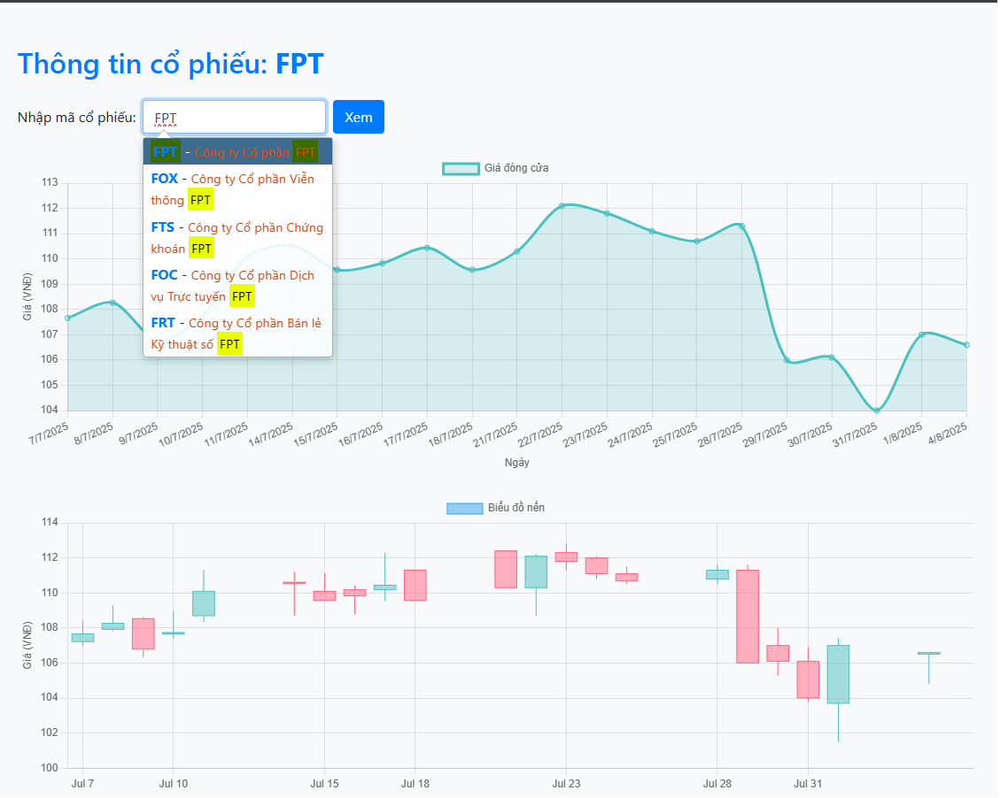
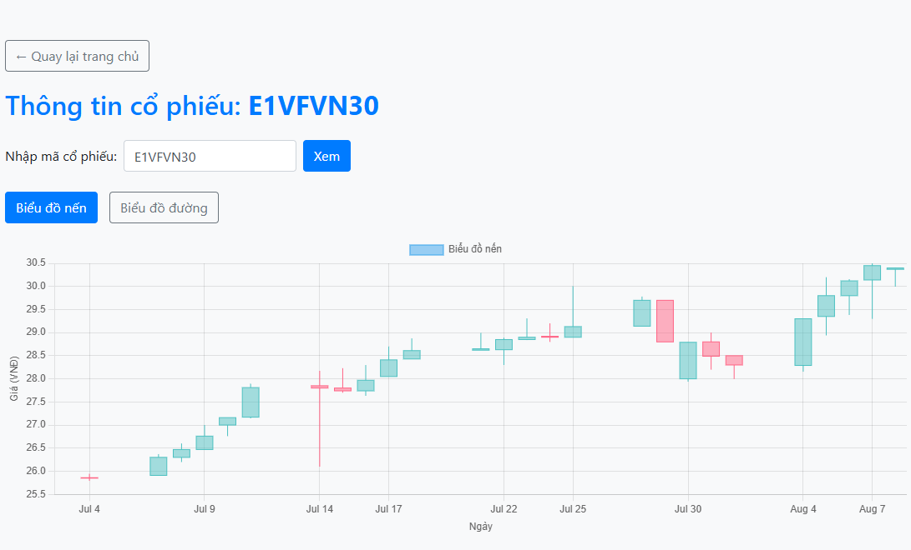
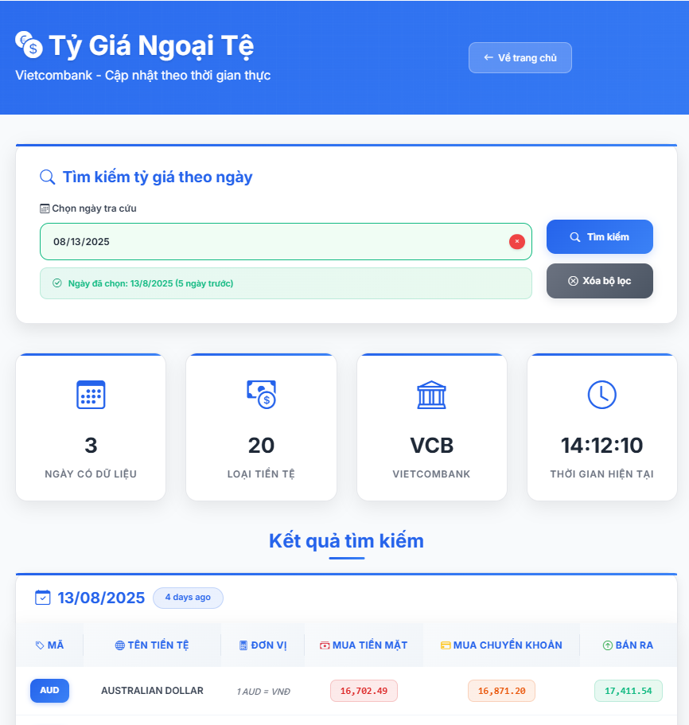
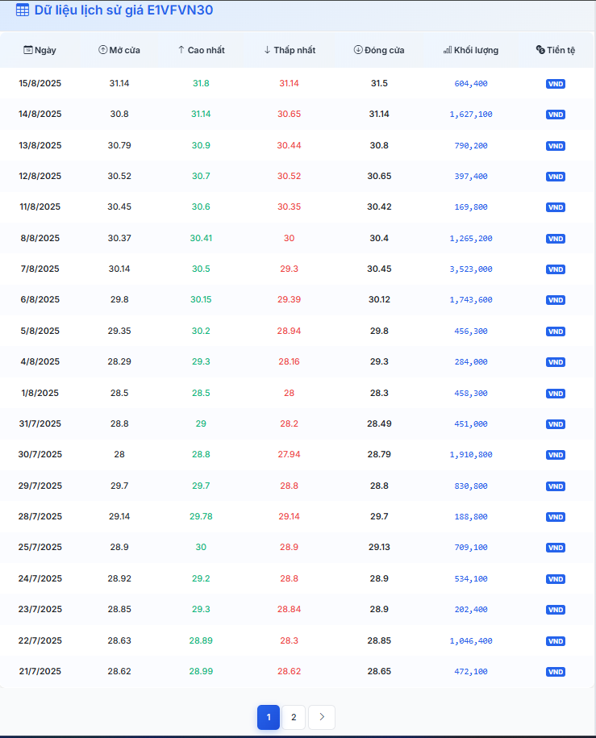
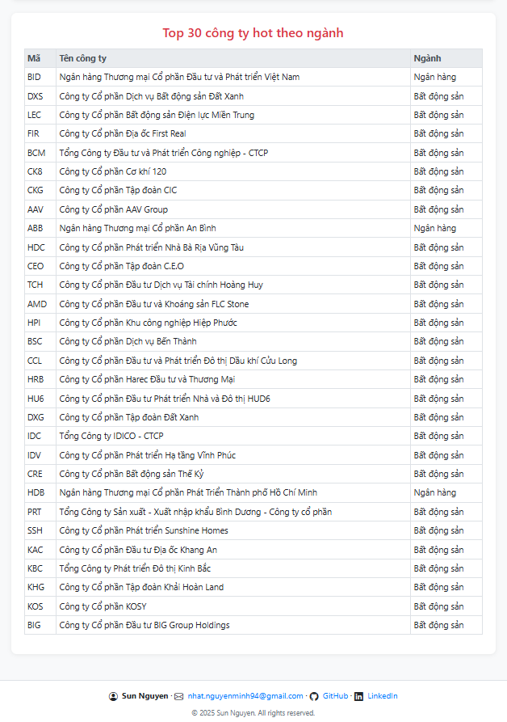
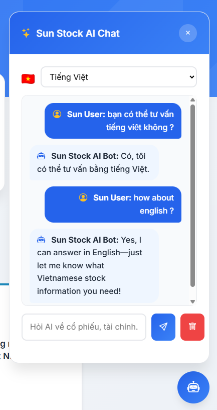
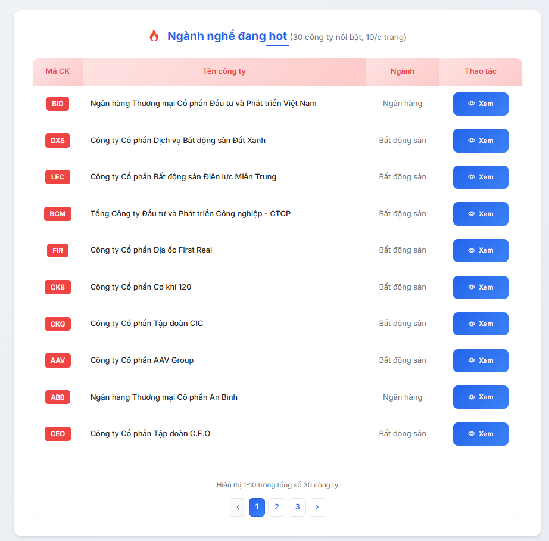
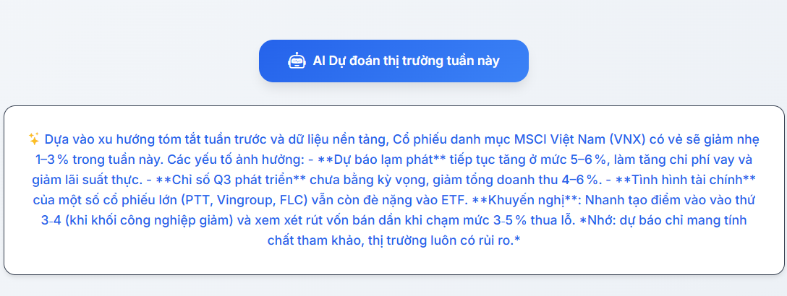

# Sun Stock AI – Vietnam’s Smart Stock App

Ứng dụng web giúp tra cứu giá cổ phiếu Việt Nam, sử dụng **Laravel 12 (PHP)** và **Python**.  
Tự động cập nhật dữ liệu, giao diện đẹp, dễ dùng, có autocomplete tìm mã cổ phiếu.

A web application for viewing Vietnamese stock prices, built with **Laravel 12 (PHP)** and **Python**.  
Auto-update data, beautiful responsive UI, fast autocomplete for stock symbols.

---

## 🚀 Tính năng nổi bật / Key Features

- **Đăng ký & đăng nhập / Register & Login**: Quản lý tài khoản người dùng, bảo mật, xác thực.
- **AI dự đoán thị trường tuần này / AI weekly market prediction**: Nút AI trên trang chủ, dự đoán xu hướng thị trường tuần này, giới hạn cho khách chưa đăng nhập.
- **Tra cứu giá lịch sử cổ phiếu / View historical stock prices**: Bảng giá, biểu đồ nến/đường, khối lượng giao dịch.
- **Tìm kiếm mã cổ phiếu nhanh / Fast stock symbol search**: Autocomplete, cập nhật danh sách mã tự động từ Python.
- **Lưu dữ liệu vào MySQL / Save data to MySQL**: Tránh crawl trùng lặp, chỉ cập nhật khi cần.
- **Tích hợp Python / Python integration**: Lấy dữ liệu từ vnstock, cập nhật cả giá và danh sách mã.
- **Giao diện responsive / Responsive UI**: Đẹp, dễ dùng trên mọi thiết bị, Bootstrap 4 + icon.
- **Kiến trúc chuẩn SOLID / SOLID architecture**: Controller, Service, Repository, Interface rõ ràng, dễ mở rộng.
- **Footer cá nhân hóa / Personalized footer**: Hiển thị thông tin tác giả, email, GitHub, LinkedIn ở mọi trang.
- **Tỷ giá ngoại tệ Vietcombank / Vietcombank exchange rates**: Hiển thị tỷ giá 3 ngày gần nhất.
- **Top 30 công ty hot theo ngành / Top 30 hot companies by industry**: Bảng các mã nổi bật theo ngành, số lượng linh động.
- **📰 Tin tức thị trường realtime / Real-time market news**
- **🔥 Tích hợp AI Model Chat (OpenRouter) / Integrated AI Model Chat (OpenRouter)**: Popup chat bubble ở góc phải dưới, hỏi đáp về cổ phiếu, ngành, tỷ giá, tài chính.  
  Hỗ trợ chọn ngôn ngữ (Tiếng Việt/English), đổi model AI (OpenRouter: gemma3:1b, mistral, llama...), giao diện đẹp, chuyên nghiệp.
  Popup chat bubble at bottom right, ask about stocks, industries, exchange rates, finance.  
  Supports language selection (Vietnamese/English), easy AI model switching (OpenRouter: gemma3:1b, mistral, llama...), beautiful and professional UI.

---

## 🆕 Nhật ký cập nhật / Update Log
- **2025-08-25:**  
  - Thêm tính năng đăng ký, đăng nhập cho người dùng.  
    Added user registration and login feature.
  - Thêm nút AI dự đoán thị trường tuần này trên trang chủ, chỉ cho khách chưa đăng nhập xem 1 lần, thành viên đăng nhập dùng không giới hạn.  
    Added AI weekly market prediction button on homepage, guests can view once, logged-in users unlimited.
- **2025-08-23:**  
  - Chuyển AI Model Chat từ Ollama sang OpenRouter API: Không cần cài đặt, chỉ cần API key, hỗ trợ nhiều model AI mạnh, dễ đổi model.  
    Migrated AI Model Chat from Ollama to OpenRouter API: No installation required, just an API key, supports many powerful AI models, easy model switching.
  - Cập nhật README song ngữ, hướng dẫn tích hợp và đổi model AI.  
    Updated bilingual README, integration guide, and AI model switching instructions.

- **2025-08-17:**  
  - Thêm tin tức thị trường VnExpress RSS, hiển thị 6 tin mới nhất với giao diện hiện đại.  
    Added VnExpress market news RSS, displaying 6 latest news items with a modern UI.
  - Tối ưu UX homepage: Sắp xếp lại các section, cải thiện giao diện và hiệu ứng.  
    Optimized homepage UX: Reordered sections, improved UI and visual effects.

- **Các phiên bản trước đó / Earlier versions:**  
  - Tra cứu giá cổ phiếu, biểu đồ, autocomplete tìm kiếm, lưu dữ liệu MySQL, tích hợp Python (vnstock), tỷ giá Vietcombank, top công ty hot theo ngành, giao diện responsive, kiến trúc SOLID, popup AI chat thông minh, footer cá nhân hóa.  
    Stock price lookup, charts, autocomplete search, MySQL data storage, Python (vnstock) integration, Vietcombank exchange rates, top hot companies by industry, responsive UI, SOLID architecture, smart popup AI chat, personalized footer.

---

## 📸 Ảnh màn hình / Screenshots











---

## ⚡ Hướng dẫn cài đặt / Quick Start

1. **Clone & cài đặt PHP / Clone & install PHP dependencies:**
    ```bash
    git clone https://github.com/nhatnguyen94/stock-app.git
    cd stock-app
    composer install
    cp .env.example .env
    php artisan key:generate
    ```

2. **Cấu hình MySQL trong `.env` / Configure MySQL in `.env`**

3. **Tạo database `stock_app` trong MySQL / Create database `stock_app` in MySQL**

4. **Chạy migrate / Run migrations:**
    ```bash
    php artisan migrate
    ```

5. **Thêm database mẫu / Add sample database:**  
   Đã thêm file `stock_app.sql` chứa dữ liệu mẫu.  
   Để import vào MySQL, chạy lệnh sau:  
    ```bash
    mysql -u root -p stock_app < stock_app.sql
    ```
   (Thay `root` bằng user của bạn nếu khác / Replace `root` with your MySQL user if different)

6. **Cài Python & vnstock / Install Python & vnstock:**
    ```bash
    pip install vnstock
    ```

7. **Kiểm tra script Python / Test Python scripts:**
    ```bash
    python py/get_stock.py FPT
    python py/get_stock_list.py
    python py/get_hot_industries.py 30
    ```
    (Có thể đổi số 30 thành số bạn muốn / You can change 30 to any number you want)

8. **Chạy server / Start server:**
    ```bash
    php artisan serve
    ```
    Truy cập: http://127.0.0.1:8000/  
    Visit: http://127.0.0.1:8000/

---

## 🤖 Hướng dẫn cài đặt & sử dụng AI Model Chat (OpenRouter API)

### 1. Đăng ký & lấy API key OpenRouter

- Truy cập [https://openrouter.ai](https://openrouter.ai)
- Đăng ký tài khoản, vào phần **API Keys** để lấy key miễn phí.

- Thêm vào file `.env`:
    ```
    OPENROUTER_API_KEY=your_openrouter_api_key
    ```

### 2. Sử dụng AI Chat trên web

- Nhấn vào icon 💬 ở góc phải dưới để mở popup chat AI.
- Chọn ngôn ngữ (🇻🇳/🇺🇸), nhập câu hỏi về cổ phiếu, ngành, tỷ giá, tài chính...
- AI sẽ trả lời bằng tiếng Việt hoặc English theo lựa chọn.
- Có thể đổi model AI bằng cách sửa tên model trong file `app/Services/AiService.php`, ví dụ:
    ```
    meta-llama/llama-3-70b-instruct
    mistralai/mixtral-8x7b-instruct
    nousresearch/nous-hermes-2-mistral-7b
    openchat/openchat-3.5-0106
    ```
- Tham khảo danh sách model tại: [https://openrouter.ai/models](https://openrouter.ai/models)

---

## 🤖 AI Model Chat Setup Guide (OpenRouter API)

### 1. Register & get OpenRouter API key

- Go to [https://openrouter.ai](https://openrouter.ai)
- Sign up, get your free API key in the **API Keys** section.

- Add to your `.env` file:
    ```
    OPENROUTER_API_KEY=your_openrouter_api_key
    ```

### 2. Use AI Chat on the web

- Click the 💬 icon at the bottom right to open the AI chat popup.
- Select language (🇻🇳/🇺🇸), enter your question about stocks, industries, exchange rates, finance...
- AI will reply in Vietnamese or English as selected.
- You can change the AI model by editing the model name in `app/Services/AiService.php`, e.g.:
    ```
    meta-llama/llama-3-70b-instruct
    mistralai/mixtral-8x7b-instruct
    nousresearch/nous-hermes-2-mistral-7b
    openchat/openchat-3.5-0106
    ```
- See all available models at: [https://openrouter.ai/models](https://openrouter.ai/models)

---

## 💡 Cách sử dụng / Usage

- Truy cập trang chủ, nhập mã cổ phiếu (ví dụ: FPT, VCB, E1VFVN30...)
- Xem bảng giá lịch sử, biểu đồ, thông tin chi tiết.
- Tìm kiếm mã cổ phiếu nhanh với autocomplete.
- Xem tỷ giá ngoại tệ Vietcombank 3 ngày gần nhất.
- Xem top 30 công ty hot theo ngành, số lượng linh động.
- Footer luôn hiển thị thông tin tác giả.
- **Chat AI thông minh về tài chính, cổ phiếu, tỷ giá ngay trên web!**

Go to homepage, enter stock symbol (e.g. FPT, VCB, E1VFVN30...)
View historical price table, charts, and details.
Fast autocomplete for stock symbol search.
See Vietcombank exchange rates for the last 3 days.
See top 30 hot companies by industry, dynamic limit.
Footer always shows author info.
**Smart AI Chat about finance, stocks, exchange rates directly on the web!**

---

## 🛠️ Kiến trúc & Công nghệ / Architecture & Technology

- **Laravel 12** (PHP)
- **Python 3 + vnstock**
- **Bootstrap 4, Bootstrap Icons**
- **OpenRouter AI Model Chat**
- **SOLID: Controller, Service, Repository, Interface**
- **MySQL**

---

## 👤 Tác giả / Author

**Sun Nguyen**  
Email: [nhat.nguyenminh94@gmail.com](mailto:nhat.nguyenminh94@gmail.com)  
GitHub: [nhatnguyen94/stock-app](https://github.com/nhatnguyen94/sunstock-ai-vn)  
LinkedIn: [Sun Nguyen](https://www.linkedin.com/in/sunnguyen3011/)

---

MIT License © 2025