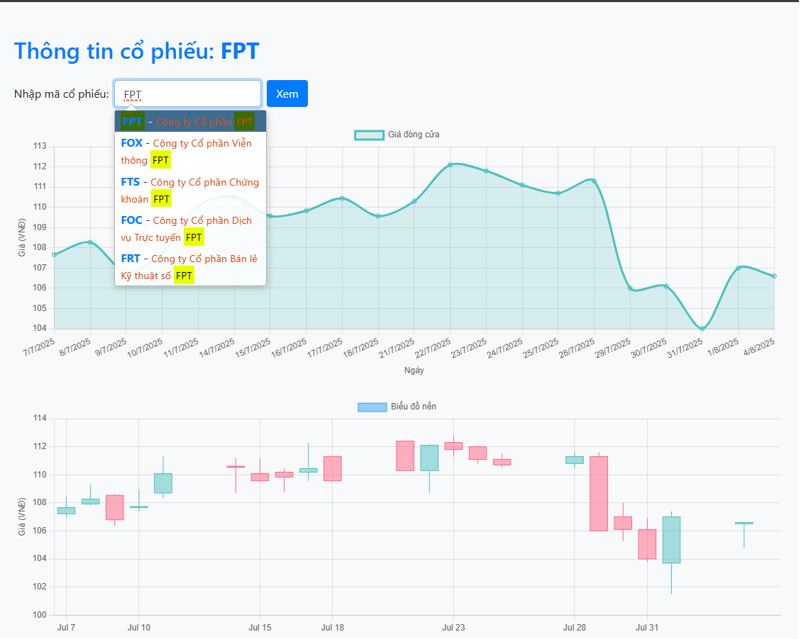
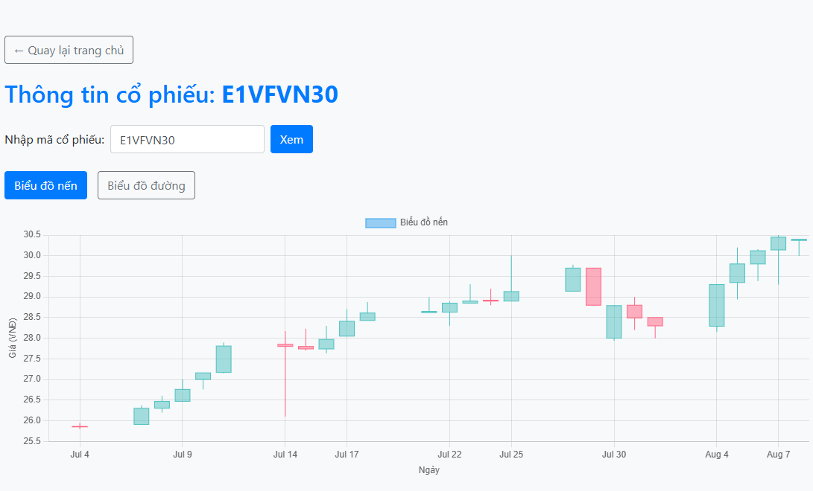
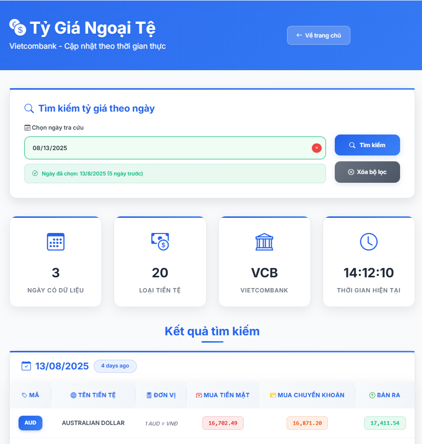
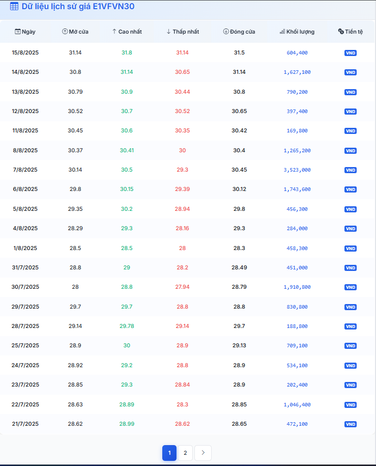
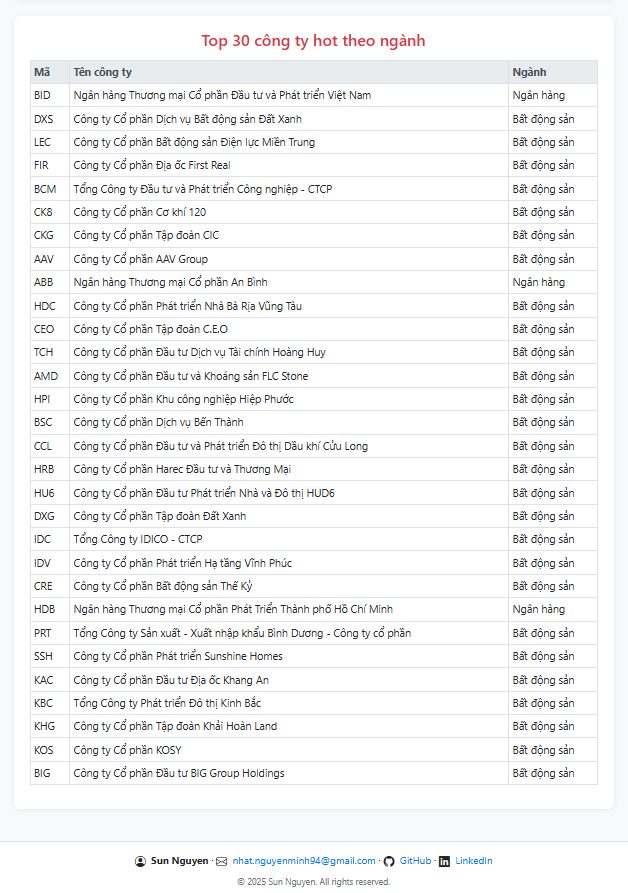
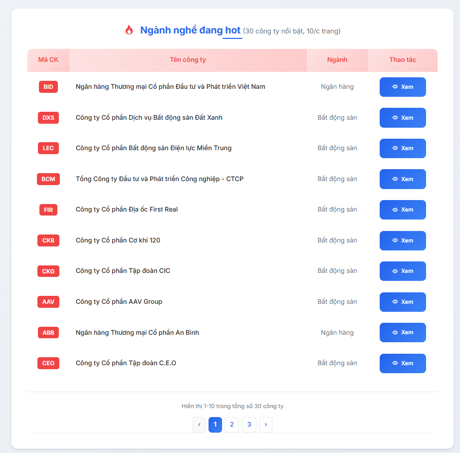
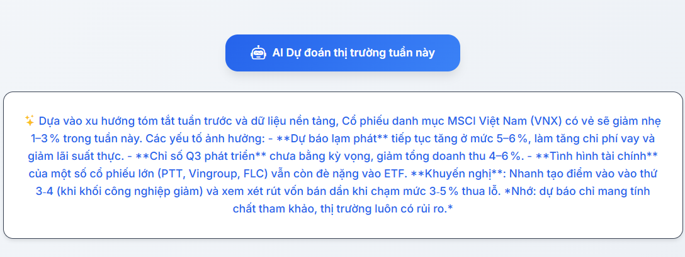

# Sun Stock AI – Vietnam Stock Platform

**Sun Stock AI** là nền tảng web quản lý & tra cứu cổ phiếu Việt Nam, xây dựng trên kiến trúc tách biệt Frontend/Backend chuẩn Laravel 12 và Python, tích hợp AI, quản lý danh mục đầu tư, tỷ giá, tin tức, RBAC, bảo mật hiện đại.

---

## 🏗️ Kiến trúc & Công nghệ
- **Laravel 12 (PHP)**: Backend, Frontend tách biệt, chuẩn SOLID, Repository/Service/Interface rõ ràng.
- **Python**: Lấy dữ liệu giá, danh sách mã, tỷ giá, ngành hot.
- **MySQL**: Lưu trữ dữ liệu cổ phiếu, người dùng, danh mục, tỷ giá.
- **AI (OpenRouter)**: Dự đoán thị trường, chat tài chính, gợi ý cân bằng danh mục.
- **RBAC**: Quản lý phân quyền, đăng nhập riêng cho admin và user.
- **Giao diện Blade + Bootstrap**: Responsive, hiện đại, dễ mở rộng.

## 📂 Sơ đồ thư mục chính

```
app/
  Frontend/Controllers, Services, Repositories, Interfaces
  Backend/Controllers, Services, Repositories, Interfaces
  Models/ (dùng chung)
routes/web.php
py/ (Python scripts)
resources/views/ (Blade UI)
docs/ (Tài liệu phát triển)
```

## 🚀 Tính năng nổi bật
- Đăng ký, đăng nhập, xác thực, bảo mật.
- Quản lý danh mục đầu tư (Portfolio) – thêm/xóa cổ phiếu, thống kê, cảnh báo giá.
- Xem giá cổ phiếu, biểu đồ, lịch sử, top ngành hot.
- Tìm kiếm mã nhanh, autocomplete, cập nhật tự động từ Python.
- Tỷ giá ngoại tệ Vietcombank, cập nhật 3 ngày gần nhất.
- Tin tức thị trường realtime (VnExpress RSS).
- AI dự đoán thị trường, chat tài chính, gợi ý cân bằng danh mục.
- RBAC: Phân quyền, đăng nhập riêng admin/user.
- Giao diện đẹp, responsive, tối ưu UX.

## ⚙️ Quy tắc phát triển & đóng góp
- Tách biệt hoàn toàn Frontend/Backend (namespace App\Frontend\*, App\Backend\*).
- Models dùng chung (App\Models).
- Bắt buộc dùng Repository/Service/Interface, binding qua AppServiceProvider.
- Ghi chú, cập nhật tài liệu tại docs/ khi thêm/chỉnh sửa tính năng.
- Xem chi tiết tại [docs/GUIDELINES.md](docs/GUIDELINES.md).

## 🆕 Nhật ký cập nhật (Update Log)
Xem chi tiết tại [docs/HISTORY.md](docs/HISTORY.md). Một số cập nhật gần nhất:

- **2026-05-16:** Cải tiến search, bổ sung ETF, tối ưu pipeline backend, fix UI/UX.
- **2026-05-01:** Xóa toàn bộ controller/service/repo/interface cũ, chuẩn hóa kiến trúc.
- **2025-08-25:** Thêm đăng ký/đăng nhập, AI dự đoán thị trường, xác thực email.
- **2025-08-23:** Chuyển AI chat sang OpenRouter, hỗ trợ nhiều model AI mạnh.
- **2025-08-17:** Thêm tin tức thị trường, tối ưu giao diện homepage.

## 👨‍💻 Hướng dẫn cài đặt nhanh
1. Clone repo, cài đặt PHP 8.2+, Composer, MySQL, Python 3.10+.
2. `composer install` – cài đặt PHP dependencies.
3. `cp .env.example .env` và cấu hình DB, OpenRouter API key.
4. `php artisan migrate --seed` – tạo bảng và dữ liệu mẫu.
5. `npm install && npm run build` – build frontend.
6. Cài Python packages: `pip install -r py/requirements.txt`.
7. Chạy các script Python để cập nhật dữ liệu.
8. Khởi động server: `php artisan serve`.

## 📸 Ảnh màn hình










---

## ⚡ Hướng dẫn cài đặt / Quick Start

1. **Clone & cài đặt PHP / Clone & install PHP dependencies:**
    ```bash
    git clone https://github.com/nhatnguyen94/stock-app.git
    cd stock-app
    composer install
    cp .env.example .env
    php artisan key:generate
    ```

2. **Cấu hình MySQL trong `.env` / Configure MySQL in `.env`**

3. **Tạo database `stock_app` trong MySQL / Create database `stock_app` in MySQL**

4. **Chạy migrate / Run migrations:**
    ```bash
    php artisan migrate
    ```

5. **Thêm database mẫu / Add sample database:**  
   Đã thêm file `stock_app.sql` chứa dữ liệu mẫu.  
   Để import vào MySQL, chạy lệnh sau:  
    ```bash
    mysql -u root -p stock_app < stock_app.sql
    ```
   (Thay `root` bằng user của bạn nếu khác / Replace `root` with your MySQL user if different)

6. **Cài Python & vnstock / Install Python & vnstock:**
    ```bash
    pip install vnstock
    ```

7. **Kiểm tra script Python / Test Python scripts:**
    ```bash
    python py/get_stock.py FPT
    python py/get_stock_list.py
    python py/get_hot_industries.py 30
    ```
    (Có thể đổi số 30 thành số bạn muốn / You can change 30 to any number you want)

8. **Chạy server / Start server:**
    ```bash
    php artisan serve
    ```
    Truy cập: http://127.0.0.1:8000/  
    Visit: http://127.0.0.1:8000/

---

## 🤖 Hướng dẫn cài đặt & sử dụng AI Model Chat (OpenRouter API)

### 1. Đăng ký & lấy API key OpenRouter

- Truy cập [https://openrouter.ai](https://openrouter.ai)
- Đăng ký tài khoản, vào phần **API Keys** để lấy key miễn phí.

- Thêm vào file `.env`:
    ```
    OPENROUTER_API_KEY=your_openrouter_api_key
    ```

### 2. Sử dụng AI Chat trên web

- Nhấn vào icon 💬 ở góc phải dưới để mở popup chat AI.
- Chọn ngôn ngữ (🇻🇳/🇺🇸), nhập câu hỏi về cổ phiếu, ngành, tỷ giá, tài chính...
- AI sẽ trả lời bằng tiếng Việt hoặc English theo lựa chọn.
- Có thể đổi model AI bằng cách sửa tên model trong file `app/Services/AiService.php`, ví dụ:
    ```
    meta-llama/llama-3-70b-instruct
    mistralai/mixtral-8x7b-instruct
    nousresearch/nous-hermes-2-mistral-7b
    openchat/openchat-3.5-0106
    ```
- Tham khảo danh sách model tại: [https://openrouter.ai/models](https://openrouter.ai/models)

---

## 🤖 AI Model Chat Setup Guide (OpenRouter API)

### 1. Register & get OpenRouter API key

- Go to [https://openrouter.ai](https://openrouter.ai)
- Sign up, get your free API key in the **API Keys** section.

- Add to your `.env` file:
    ```
    OPENROUTER_API_KEY=your_openrouter_api_key
    ```

### 2. Use AI Chat on the web

- Click the 💬 icon at the bottom right to open the AI chat popup.
- Select language (🇻🇳/🇺🇸), enter your question about stocks, industries, exchange rates, finance...
- AI will reply in Vietnamese or English as selected.
- You can change the AI model by editing the model name in `app/Services/AiService.php`, e.g.:
    ```
    meta-llama/llama-3-70b-instruct
    mistralai/mixtral-8x7b-instruct
    nousresearch/nous-hermes-2-mistral-7b
    openchat/openchat-3.5-0106
    ```
- See all available models at: [https://openrouter.ai/models](https://openrouter.ai/models)

---

## 💡 Cách sử dụng / Usage

- Truy cập trang chủ, nhập mã cổ phiếu (ví dụ: FPT, VCB, E1VFVN30...)
- Xem bảng giá lịch sử, biểu đồ, thông tin chi tiết.
- Tìm kiếm mã cổ phiếu nhanh với autocomplete.
- Xem tỷ giá ngoại tệ Vietcombank 3 ngày gần nhất.
- Xem top 30 công ty hot theo ngành, số lượng linh động.
- Footer luôn hiển thị thông tin tác giả.
- **Chat AI thông minh về tài chính, cổ phiếu, tỷ giá ngay trên web!**

Go to homepage, enter stock symbol (e.g. FPT, VCB, E1VFVN30...)
View historical price table, charts, and details.
Fast autocomplete for stock symbol search.
See Vietcombank exchange rates for the last 3 days.
See top 30 hot companies by industry, dynamic limit.
Footer always shows author info.
**Smart AI Chat about finance, stocks, exchange rates directly on the web!**

---

## 🛠️ Kiến trúc & Công nghệ / Architecture & Technology

- **Laravel 12** (PHP)
- **Python 3 + vnstock**
- **Bootstrap 4, Bootstrap Icons**
- **OpenRouter AI Model Chat**
- **SOLID: Controller, Service, Repository, Interface**
- **MySQL**

---

## 👤 Tác giả / Author

**Sun Nguyen**  
Email: [nhat.nguyenminh94@gmail.com](mailto:nhat.nguyenminh94@gmail.com)  
GitHub: [nhatnguyen94/stock-app](https://github.com/nhatnguyen94/sunstock-ai-vn)  
LinkedIn: [Sun Nguyen](https://www.linkedin.com/in/sunnguyen3011/)

---

MIT License © 2025