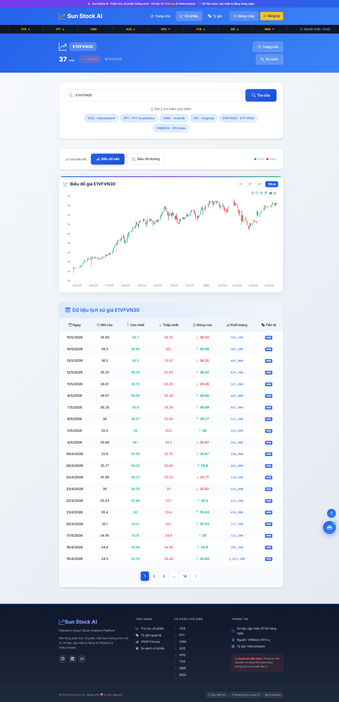
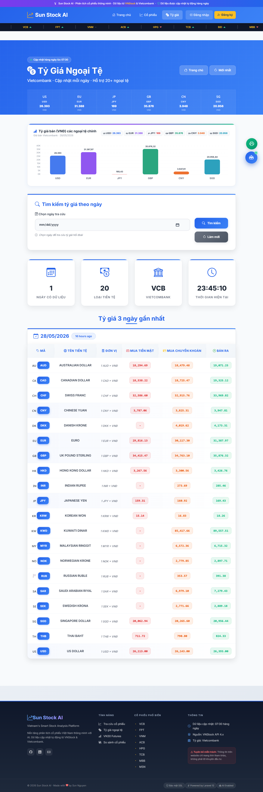
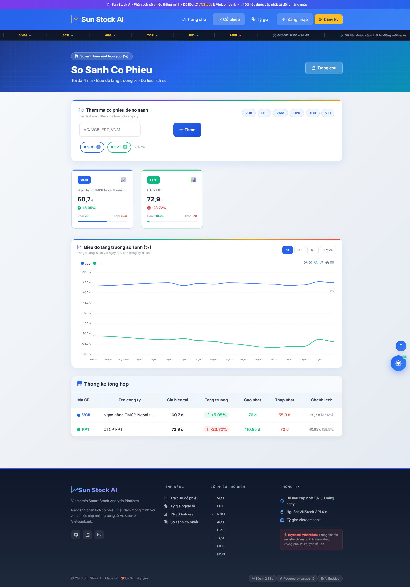
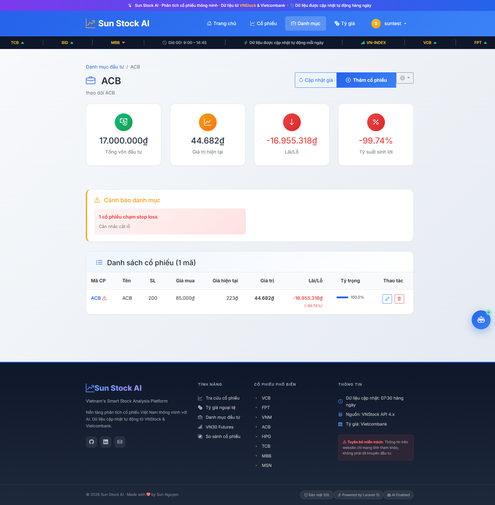
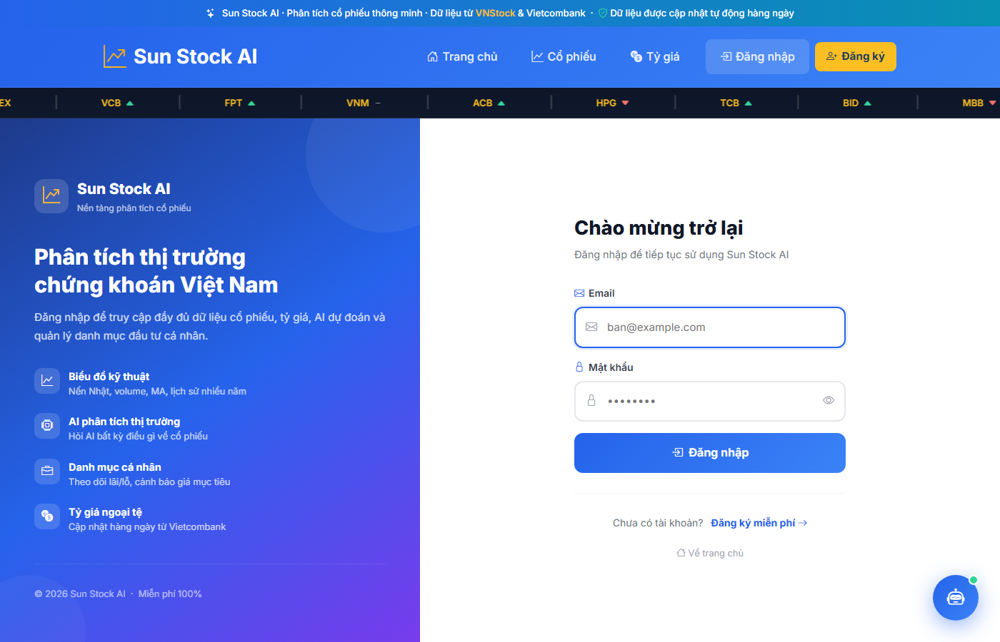
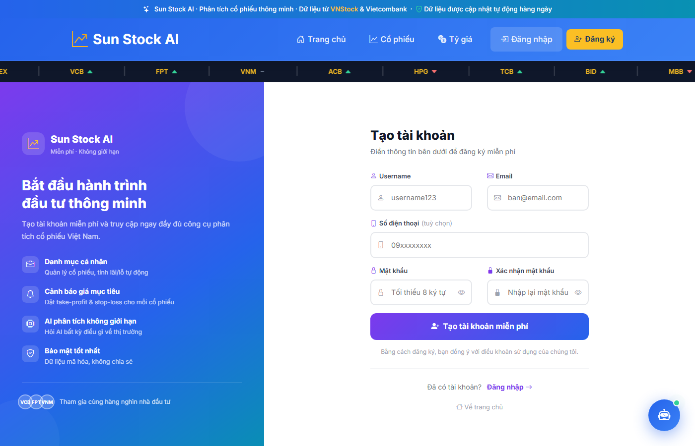
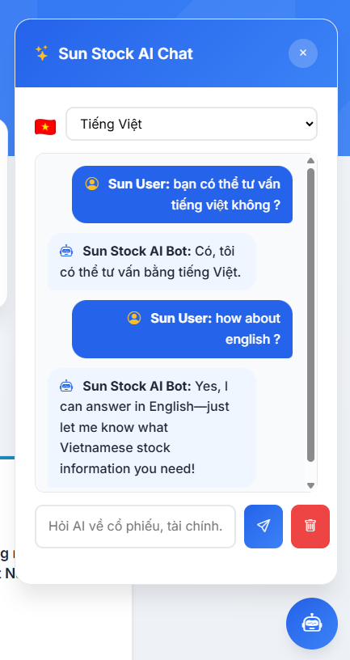

# Sun Stock AI – Vietnam Stock Platform

> 🇬🇧 [English](#english) | 🇻🇳 [Tiếng Việt](#tiếng-việt)

---

<a name="english"></a>
# 🇬🇧 English

**Sun Stock AI** is a web platform for tracking and managing Vietnamese stocks, built with Laravel 12 and Python. It features AI-powered market analysis, portfolio management, exchange rates, news, and a full role-based admin system.

## 📸 Screenshots

| Homepage | Stock Detail |
|---|---|
|  |  |

| Exchange Rates | Compare Stocks |
|---|---|
|  |  |

| Portfolio | Login |
|---|---|
|  |  |

| Register |
|---|
|  |

| AI CHAT BOT |
|---|
|  |

## 🚀 Features

- **Stock Viewer** — Search any Vietnamese stock symbol with autocomplete, view historical price charts (candlestick & line) and data tables.
- **📊 Technical Indicators** — Overlay MA20/50/200, Bollinger Bands on the main chart; RSI(14) and MACD(12,26,9) display as dedicated sub-charts below. All indicators update when filtering by time period (1M/3M/6M/1Y/All).
- **🏦 Company Financials** — On-demand financial statement viewer: Income Statement, Balance Sheet, Cash Flow, and Financial Ratios — quarterly or annual — powered by the KBS data source via vnstock.
- **Compare Stocks** — Side-by-side chart comparison for multiple symbols.
- **Hot Industries** — Discover top-performing stocks in Banking, Real Estate, and IT sectors.
- **Portfolio Management** — Create portfolios, track holdings, monitor profit/loss in real time, set price targets and stop-loss alerts, get AI rebalancing suggestions.
- **Exchange Rates** — View Vietcombank (VCB) foreign exchange rates, updated daily.
- **Market News** — Aggregated news from 5 RSS sources (VnExpress ×2, CafeF ×2, Dân Trí ×1) stored in DB with categories (Kinh doanh, Chứng khoán, Thị trường, Doanh nghiệp). Dedicated `/news` page with category filtering, search, and pagination. Synced every 30 minutes via scheduler.
- **AI Chat & Prediction** — Ask financial questions and get market predictions powered by OpenRouter AI (supports multiple LLM models).
- **User Accounts** — Register, log in, email verification, profile management.
- **Role-Based Access Control (RBAC)** — Separate admin login, role management (Admin, Webadmin, AdminSupport, User), permission gates.
- **Admin Panel** — Manage users, stocks, news, portfolios, and view activity timeline.

## 🛠️ Tech Stack

| Layer | Technology |
|---|---|
| Backend | Laravel 12 (PHP 8.2+) |
| Data Fetching | Python 3 + vnstock 4.x library |
| AI | Groq API — `llama-3.3-70b-versatile` (free, 14,400 req/day, ~0.4s response) |
| Database | MySQL (RANGE-partitioned by year for scale) |
| Charts | ApexCharts 3.49 (candlestick, line, bar, mixed) |
| Frontend | Blade Templates + Bootstrap 4.5 + Bootstrap Icons |
| Architecture | SOLID — Controller / Service / Repository / Interface |
| Queue | Redis Queue — 6 parallel workers (Docker supervisor) |

## ⚡ Quick Start (Docker — recommended)

**Requirements:** Docker Desktop

```bash
# 1. Clone
git clone https://github.com/nhatnguyen94/sunstock-ai-vn.git
cd stock-app
```

```bash
# 2. Configure .env (copy from .env.xampp as base)
cp .env.xampp .env
# Edit DB_HOST=mysql, REDIS_HOST=redis, APP_URL=https://sunstock-local.dev
# Add: GROQ_API_KEY=your_groq_key
```

```bash
# 3. Add hosts entry (Windows: C:\Windows\System32\drivers\etc\hosts)
# 127.0.0.1 sunstock-local.dev
```

```bash
# 4. Start containers
docker compose up -d
docker exec stock-app-php-1 composer install
docker exec stock-app-php-1 php artisan migrate --seed
docker exec stock-app-php-1 php artisan sync:stock-data
```

```bash
# 5. Visit https://sunstock-local.dev
```

> See [docs/DOCKER.md](docs/DOCKER.md) for full Docker setup, SSL certificate, MySQL Workbench connection.

## ⚡ Quick Start (XAMPP / manual)

**Requirements:** PHP 8.2+, Composer, MySQL, Node.js, Python 3.10+

```bash
# 1. Clone & install dependencies
git clone https://github.com/nhatnguyen94/sunstock-ai-vn.git
cd stock-app
composer install
npm install && npm run build
cp .env.example .env
php artisan key:generate
```

```bash
# 2. Configure .env
DB_DATABASE=stock_app
DB_USERNAME=root
DB_PASSWORD=
GROQ_API_KEY=your_groq_key_here
```

```bash
# 3. Database setup (choose one)
php artisan migrate --seed            # Fresh setup with seeds
# OR import sample data:
mysql -u root -p stock_app < stock_app.sql
```

```bash
# 4. Install Python dependencies
pip install vnstock
```

```bash
# 5. Sync stock data
php artisan sync:stock-data         # Sync stock symbols
php artisan sync:stock-prices       # Sync historical prices
```

```bash
# 6. Run the app
php artisan serve
# Visit: http://127.0.0.1:8000
```

## 🤖 AI Chat Setup

1. Get a free API key at [console.groq.com](https://console.groq.com) (no credit card required)
2. Add to `.env`: `GROQ_API_KEY=gsk_...`
3. The chat widget appears on the bottom-right of every page
4. To change the AI model, edit `AiService::GROQ_MODELS` in `app/Frontend/Services/AiService.php`
5. Available free models: `llama-3.3-70b-versatile`, `llama3-70b-8192`, `gemma2-9b-it`

## 📁 Project Structure

```
app/
  Frontend/   Controllers, Services, Repositories, Interfaces (user-facing)
  Backend/    Controllers (admin panel)
  Models/     Shared Eloquent models
py/           Python scripts (stock data, exchange rates, AI)
resources/views/  Blade templates
docs/         Developer documentation
```

> See [docs/STRUCTURE.md](docs/STRUCTURE.md) for the full architecture reference.

## 🆕 Changelog

| Date | Update |
|---|---|
| 2026-05-31 | **Multi-source News** — 5 RSS feeds (VnExpress ×2, CafeF ×2, Dân Trí ×1) → DB with `news_categories` FK; dedicated `/news` page with category nav, search, pagination; scheduler syncs every 30 min |
| 2026-05-30 | **Docker migration** — Nginx + PHP-FPM + MySQL + Redis + HTTPS (`sunstock-local.dev`) |
| 2026-05-30 | **Switched AI to Groq** — 14,400 req/day free, ~0.4s response, stable 100% |
| 2026-05-30 | **Security**: XSS fix (escapeHtml), prompt injection hardening, input sanitization |
| 2026-05-30 | **Idempotency**: sync commands skip already-synced data; `--force` flag to override |
| 2026-05-29 | **Technical Indicators** (MA/BB/RSI/MACD) + **Company Financials** on stock page |
| 2026-05-29 | Historical data backfill via 6-worker parallel queue; MySQL RANGE partitioning |
| 2026-05-29 | Fixed vnstock 4.x API breakage & Laravel 12 scheduler; pagination bug fix |
| 2026-05-28 | Full documentation audit & expansion |
| 2026-05-16 | Improved search, added ETF support, backend pipeline fixes |
| 2026-05-02 | RBAC system, separate admin login, role management |
| 2025-08-25 | Email verification, AI market prediction |
| 2025-08-23 | AI Chat feature, portfolio management |

> Full history: [docs/HISTORY.md](docs/HISTORY.md)

## 👤 Author

**Sun Nguyen**  
Email: [nhat.nguyenminh94@gmail.com](mailto:nhat.nguyenminh94@gmail.com)  
GitHub: [nhatnguyen94/sunstock-ai-vn](https://github.com/nhatnguyen94/sunstock-ai-vn)  
LinkedIn: [Sun Nguyen](https://www.linkedin.com/in/sunnguyen3011/)

MIT License © 2025–2026

---

<a name="tiếng-việt"></a>
# 🇻🇳 Tiếng Việt

**Sun Stock AI** là nền tảng web tra cứu và quản lý cổ phiếu Việt Nam, xây dựng trên Laravel 12 và Python. Tích hợp AI phân tích thị trường, quản lý danh mục đầu tư, tỷ giá ngoại tệ, tin tức và hệ thống phân quyền admin đầy đủ.

## 🚀 Tính năng

- **Xem cổ phiếu** — Tìm kiếm mã cổ phiếu với autocomplete, xem biểu đồ giá lịch sử (nến Nhật & đường) và bảng dữ liệu.
- **📊 Chỉ báo kỹ thuật** — Thêm MA20/50/200, Bollinger Bands lên biểu đồ chính; RSI(14) và MACD(12,26,9) hiển thị dưới dạng biểu đồ phụ riêng biệt. Tất cả chỉ báo cập nhật theo bộ lọc thời gian (1T/3T/6T/1N/Tất cả).
- **🏦 Tài chính doanh nghiệp** — Xem báo cáo tài chính theo yêu cầu: Kết quả kinh doanh, Bảng cân đối kế toán, Lưu chuyển tiền tệ, Chỉ số tài chính — theo quý hoặc năm — từ nguồn dữ liệu KBS qua vnstock.
- **So sánh cổ phiếu** — So sánh biểu đồ nhiều mã cổ phiếu cùng lúc.
- **Ngành hot** — Khám phá cổ phiếu nổi bật trong các ngành Ngân hàng, Bất động sản, CNTT.
- **Quản lý danh mục** — Tạo danh mục đầu tư, theo dõi lợi nhuận/lỗ theo thời gian thực, đặt mức giá mục tiêu và cắt lỗ, gợi ý cân bằng danh mục bằng AI.
- **Tỷ giá ngoại tệ** — Xem tỷ giá Vietcombank cập nhật hàng ngày.
- **Tin tức thị trường** — Tổng hợp tin từ 5 nguồn RSS (VnExpress ×2, CafeF ×2, Dân Trí ×1), lưu vào DB với 4 danh mục (Kinh doanh, Chứng khoán, Thị trường, Doanh nghiệp). Trang `/news` riêng với lọc danh mục, tìm kiếm và phân trang. Đồng bộ tự động mỗi 30 phút.
- **AI Chat & Dự đoán** — Hỏi đáp tài chính và dự đoán thị trường qua OpenRouter AI (hỗ trợ nhiều model LLM).
- **Tài khoản người dùng** — Đăng ký, đăng nhập, xác thực email, quản lý hồ sơ.
- **Phân quyền (RBAC)** — Đăng nhập admin riêng biệt, quản lý vai trò (Admin, Webadmin, AdminSupport, User).
- **Trang quản trị** — Quản lý người dùng, cổ phiếu, tin tức, danh mục và xem nhật ký hoạt động.

## 🛠️ Công nghệ sử dụng

| Lớp | Công nghệ |
|---|---|
| Backend | Laravel 12 (PHP 8.2+) |
| Lấy dữ liệu | Python 3 + thư viện vnstock |
| AI | Groq API — miễn phí, 14.400 req/ngày, phản hồi ~0.4s |
| Giao diện | Blade Templates + Bootstrap 5 + Bootstrap Icons |
| Kiến trúc | SOLID — Controller / Service / Repository / Interface |

## ⚡ Cài đặt nhanh (Docker — khình cận)

**Yêu cầu:** Docker Desktop

```bash
git clone https://github.com/nhatnguyen94/sunstock-ai-vn.git
cd stock-app
# Cấu hình .env: DB_HOST=mysql, REDIS_HOST=redis, GROQ_API_KEY=...
docker compose up -d
docker exec stock-app-php-1 composer install
docker exec stock-app-php-1 php artisan migrate --seed
# Thêm 127.0.0.1 sunstock-local.dev vào hosts file
# Truy cập https://sunstock-local.dev
```

> Xem hướng dẫn chi tiết tại [docs/DOCKER.md](docs/DOCKER.md)

## ⚡ Cài đặt nhanh (thủ công / XAMPP)

**Yêu cầu:** PHP 8.2+, Composer, MySQL, Node.js, Python 3.10+

```bash
# 1. Clone & cài đặt
git clone https://github.com/nhatnguyen94/sunstock-ai-vn.git
cd stock-app
composer install
npm install && npm run build
cp .env.example .env
php artisan key:generate
```

```bash
# 2. Cấu hình .env
DB_DATABASE=stock_app
DB_USERNAME=root
DB_PASSWORD=
GROQ_API_KEY=your_groq_key_here
```

```bash
# 3. Khởi tạo database (chọn một trong hai)
php artisan migrate --seed            # Tạo mới từ đầu
# HOẶC import dữ liệu mẫu:
mysql -u root -p stock_app < stock_app.sql
```

```bash
# 4. Cài Python
pip install vnstock
```

```bash
# 5. Đồng bộ dữ liệu cổ phiếu
php artisan stock:sync          # Đồng bộ danh sách mã
php artisan stock:sync-prices   # Đồng bộ giá lịch sử
```

```bash
# 6. Khởi động server
php artisan serve
# Truy cập: http://127.0.0.1:8000
```

## 🤖 Cài đặt AI Chat

1. Lấy API key miễn phí tại [console.groq.com](https://console.groq.com)
2. Thêm vào `.env`: `GROQ_API_KEY=gsk_...`
3. Widget chat xuất hiện ở góc phải dưới màn hình
4. Để đổi model AI, chỉnh sửa `AiService::GROQ_MODELS` trong `app/Frontend/Services/AiService.php`
5. Xem danh sách model tại [console.groq.com/docs/models](https://console.groq.com/docs/models)

## 🆕 Nhật ký cập nhật

| Ngày | Nội dung |
|---|---|
| 2026-05-31 | **Tin tức đa nguồn** — 5 RSS feed (VnExpress ×2, CafeF ×2, Dân Trí ×1) lưu DB với bảng `news_categories`; trang `/news` riêng có dropdown danh mục trong navbar, tìm kiếm, phân trang; scheduler sync mỗi 30 phút |
| 2026-05-30 | **Docker migration** — Nginx + PHP-FPM + MySQL + Redis + HTTPS (`sunstock-local.dev`) |
| 2026-05-30 | **Chuyển AI sang Groq** — 14.400 req/ngày miễn phí, ~0.4s, ổn định 100% |
| 2026-05-30 | **Bảo mật**: Sửa XSS, chống prompt injection, sanitize input |
| 2026-05-30 | **Idempotency**: Lệnh sync bỏ qua dữ liệu đã đồng bộ; flag `--force` để buộc sync lại |
| 2026-05-29 | **Chỉ báo kỹ thuật** (MA/BB/RSI/MACD) + **Tài chính doanh nghiệp** trên trang cổ phiếu |
| 2026-05-29 | Backfill lịch sử giá song song 6 workers; phân vùng MySQL RANGE theo năm |
| 2026-05-29 | Sửa lỗi vnstock 4.x API & scheduler Laravel 12; sửa phân trang |
| 2026-05-28 | Rà soát và mở rộng toàn bộ tài liệu |
| 2026-05-16 | Cải tiến tìm kiếm, bổ sung ETF, sửa lỗi UI/UX |
| 2026-05-02 | Hệ thống RBAC, đăng nhập admin riêng, quản lý vai trò |
| 2025-08-25 | Xác thực email, AI dự đoán thị trường |
| 2025-08-23 | Tính năng AI Chat, quản lý danh mục |

> Xem đầy đủ: [docs/HISTORY.md](docs/HISTORY.md)

## 👤 Tác giả

**Sun Nguyen**  
Email: [nhat.nguyenminh94@gmail.com](mailto:nhat.nguyenminh94@gmail.com)  
GitHub: [nhatnguyen94/sunstock-ai-vn](https://github.com/nhatnguyen94/sunstock-ai-vn)  
LinkedIn: [Sun Nguyen](https://www.linkedin.com/in/sunnguyen3011/)

MIT License © 2025–2026