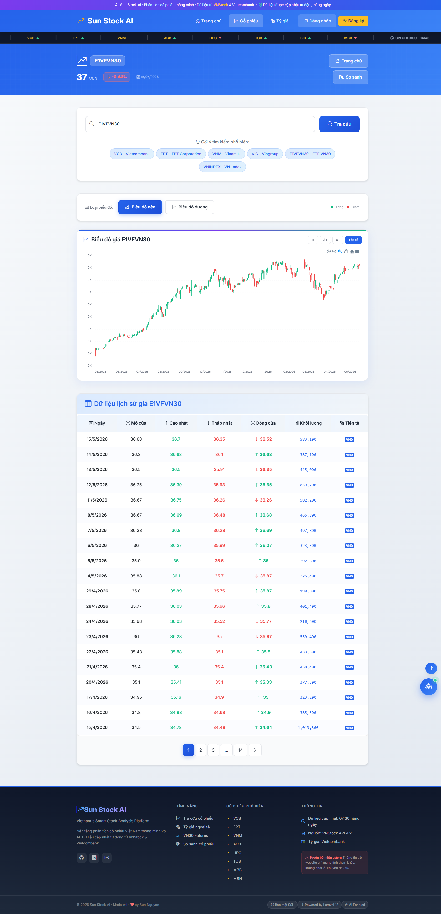
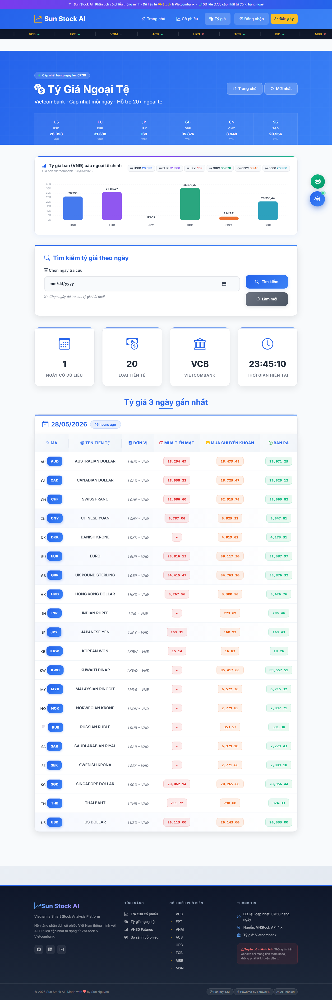
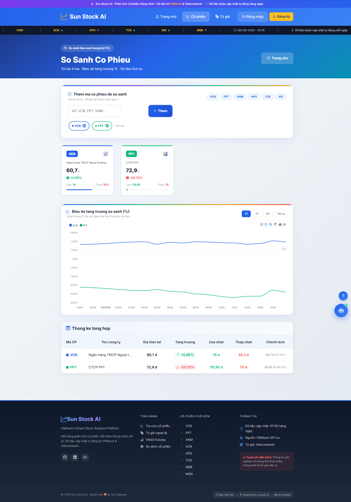
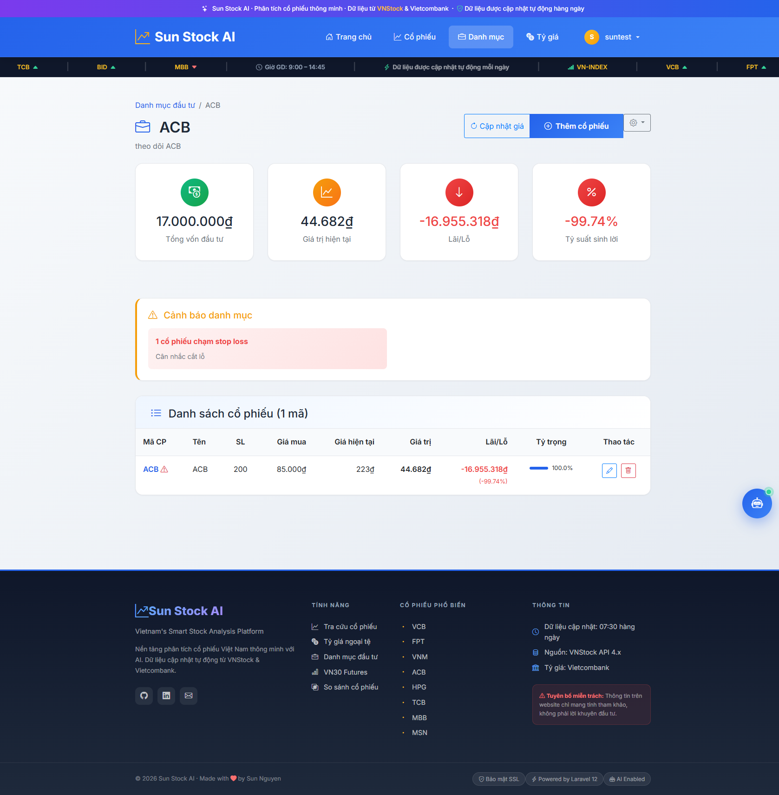
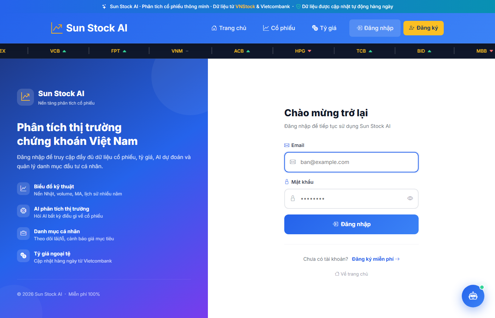
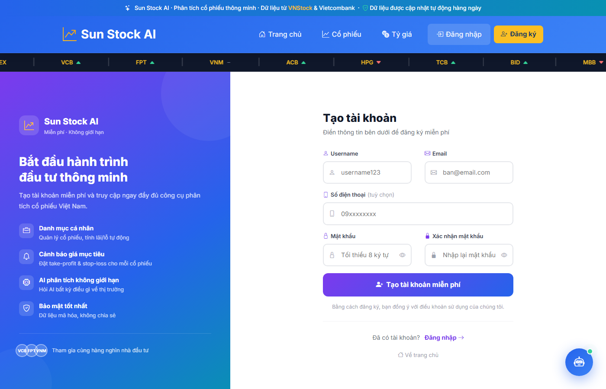
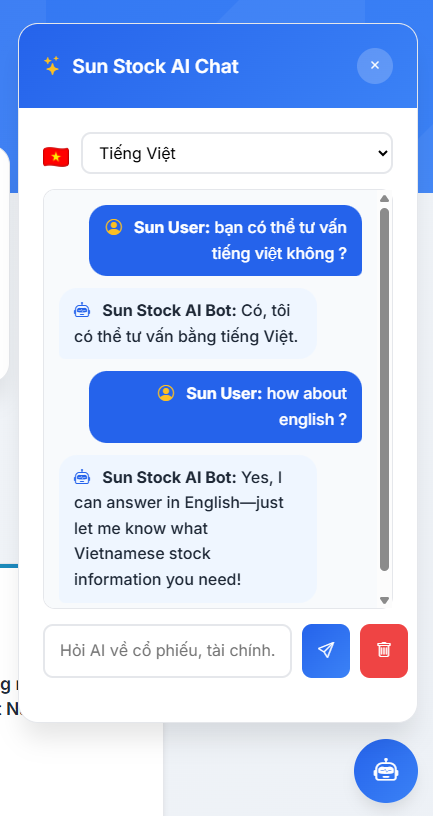

# Sun Stock AI – Vietnam Stock Platform

> 🇬🇧 [English](#english) | 🇻🇳 [Tiếng Việt](#tiếng-việt)

---

<a name="english"></a>
# 🇬🇧 English

**Sun Stock AI** is a web platform for tracking and managing Vietnamese stocks, built with Laravel 12 and Python. It features AI-powered market analysis, portfolio management with price alerts, exchange rates, news, a stock screener, and a full role-based admin system with self-service, DB-driven permission management.

## 📸 Screenshots

| Homepage | Stock Detail |
|---|---|
|  |  |

| Exchange Rates | Compare Stocks |
|---|---|
|  |  |

| Portfolio | Login |
|---|---|
|  |  |

| Register |
|---|
|  |

| AI CHAT BOT |
|---|
|  |

## 🚀 Features

- **Stock Viewer** — Search any Vietnamese stock symbol with autocomplete, view historical price charts (candlestick & line) and data tables.
- **📊 Technical Indicators** — Overlay MA20/50/200, Bollinger Bands on the main chart; RSI(14) and MACD(12,26,9) display as dedicated sub-charts below. All indicators update when filtering by time period (1M/3M/6M/1Y/All).
- **🏦 Company Financials** — On-demand financial statement viewer: Income Statement, Balance Sheet, Cash Flow, and Financial Ratios — quarterly or annual — powered by the KBS data source via vnstock.
- **🔎 Stock Screener** — Filter and rank the whole market by financial ratios (P/E, ROE, ...) sourced from the synced financial data.
- **🏢 Company Profile** — `/company/{symbol}`: overview & valuation snapshot, ownership structure and major shareholders (donut charts), board / executives / supervisory board with their holdings, subsidiaries & affiliates, and corporate events (upcoming dividends & meetings, insider trades). Cached in the DB with stale-while-revalidate; first visit loads in ~4s, later ones are instant.
- **💼 Open-ended Funds** — `/funds`: 68 Fmarket funds filterable by type / management company / name and sortable by any return window; per-fund page with NAV chart (green/red vs. start of period), max drawdown, volatility, asset allocation and top holdings (linked to company profiles); compare up to 4 funds side by side.
- **Compare Stocks** — Side-by-side chart comparison for multiple symbols.
- **Hot Industries** — Discover top-performing stocks in Banking, Real Estate, and IT sectors.
- **Portfolio Management** — Create portfolios, track holdings, monitor profit/loss in real time from actually-synced prices, set price targets and stop-loss levels (with automatic one-shot email alerts when crossed), get AI rebalancing suggestions.
- **Exchange Rates** — View Vietcombank (VCB) foreign exchange rates by date, updated daily.
- **Market News** — Aggregated news from 5 RSS sources (VnExpress ×2, CafeF ×2, Dân Trí ×1) stored in DB with categories (Kinh doanh, Chứng khoán, Thị trường, Doanh nghiệp). Dedicated `/news` page with category filtering, search, and pagination. Synced every 30 minutes via scheduler.
- **AI Chat & Prediction** — Ask financial questions and get market predictions, powered by the Groq API (free tier, ~0.4s responses).
- **User Accounts** — Register, log in, email verification, forgot/reset password, profile management (avatar, birthday, gender, address, bio).
- **Role-Based Access Control (RBAC)** — Separate admin login; roles and fine-grained permissions are managed entirely from the backend UI (**Admin > Vai trò / Quyền hạn**) — new roles and overlapping permissions don't require any code change. See [docs/RBAC.md](docs/RBAC.md).
- **Admin Panel** — Manage users, roles & permissions, stocks, news (incl. categories), portfolios, sync status, an activity timeline, self-service password change, and a live queue monitoring dashboard (real-time "currently processing" / "recently finished" job feed).

## 🛠️ Tech Stack

| Layer | Technology |
|---|---|
| Backend | Laravel 12 (PHP 8.2+) |
| Data Fetching | Python 3 + vnstock 4.x library |
| AI | Groq API — `llama-3.3-70b-versatile` (free, 14,400 req/day, ~0.4s response) |
| Database | MySQL 8 (RANGE-partitioned by year for scale) |
| Charts | TradingView Lightweight Charts 5 (bundled locally by Vite: candles, area, volume, multi-pane indicators) + in-repo SVG donut/bars |
| Frontend | Blade Templates + Bootstrap 4.5 (main site, CDN) + Tailwind CSS 4 (Vite, page-specific styles) |
| Admin Panel | Blade Templates + Tabler / Bootstrap 5 (CDN) |
| Authorization | Custom RBAC (`roles`) + DB-driven permissions (`permissions`/`permission_role`) — see [docs/RBAC.md](docs/RBAC.md) |
| Architecture | SOLID — Controller / Service / Repository / Interface, strict Frontend/Backend namespace separation |
| Queue | Redis Queue — 6 workers (Docker supervisor), custom monitoring dashboard at `/admin/queue` |

## 🔐 Security & environment variables

- **Never commit `.env`, `.env.docker`, or `.env.xampp`** — they hold real secrets and are already gitignored. Only `.env.example` is tracked in git, and it contains **placeholders only** (`your_groq_api_key`, empty passwords) — never replace those placeholders with real values before committing.
- `docker-compose.yml` requires `DB_PASSWORD` and `DB_ROOT_PASSWORD` to be set with **no insecure default** — the stack refuses to start rather than silently using a blank/weak MySQL password. Generate strong random values for both, e.g. `openssl rand -base64 24`.
- `GROQ_API_KEY` (AI chat) and `VNSTOCK_API_KEY` (optional, sponsored vnstock tier) are personal API keys — get your own free key at [console.groq.com](https://console.groq.com) and keep it out of any file that gets committed or shared.
- If a real secret is ever accidentally committed, rotating it (changing the password/regenerating the API key) is mandatory — removing it from a later commit does **not** remove it from git history.
- MySQL's port is bound to `127.0.0.1` only in `docker-compose.yml` (not exposed to the LAN/internet); keep that binding if you change the compose file.

## ⚡ Quick Start (Docker — recommended)

**Requirements:** Docker Desktop

```bash
# 1. Clone
git clone https://github.com/nhatnguyen94/sunstock-ai-vn.git
cd stock-app
```

```bash
# 2. Configure .env (copy from .env.docker as base — DB_HOST=mysql, REDIS_HOST=redis are already set for the Docker network)
cp .env.docker .env
# Then edit .env and set your own real values for:
#   DB_PASSWORD, DB_ROOT_PASSWORD   (required — no insecure default, see Security section above)
#   GROQ_API_KEY                    (for the AI chat feature)
```

```bash
# 3. Add hosts entry (Windows: C:\Windows\System32\drivers\etc\hosts)
# 127.0.0.1 sunstock-local.dev
```

```bash
# 4. Start containers
docker compose up -d
docker exec stock-app-php-1 composer install
docker exec stock-app-php-1 php artisan migrate --seed
docker exec stock-app-php-1 php artisan sync:stock-data
```

```bash
# 5. Visit https://sunstock-local.dev
```

> See [docs/DOCKER.md](docs/DOCKER.md) for full Docker setup, SSL certificate, MySQL Workbench connection.

## ⚡ Quick Start (XAMPP / manual)

**Requirements:** PHP 8.2+, Composer, MySQL, Node.js, Python 3.10+

```bash
# 1. Clone & install dependencies
git clone https://github.com/nhatnguyen94/sunstock-ai-vn.git
cd stock-app
composer install
npm install && npm run build
cp .env.example .env
php artisan key:generate
```

```bash
# 2. Configure .env — use your own real values, never commit them
DB_DATABASE=stock_app
DB_USERNAME=root
DB_PASSWORD=your_own_mysql_password
GROQ_API_KEY=your_own_groq_api_key
```

```bash
# 3. Database setup (choose one)
php artisan migrate --seed            # Fresh setup with seeds
# OR import sample data:
mysql -u root -p stock_app < stock_app.sql
```

```bash
# 4. Install Python dependencies
pip install vnstock
```

```bash
# 5. Sync stock data
php artisan sync:stock-data         # Sync stock symbols
php artisan sync:stock-prices       # Sync historical prices
```

```bash
# 6. Run the app
php artisan serve
# Visit: http://127.0.0.1:8000
```

## 🤖 AI Chat Setup

1. Get a free API key at [console.groq.com](https://console.groq.com) (no credit card required)
2. Add to `.env`: `GROQ_API_KEY=gsk_...` — keep this out of any committed file
3. The chat widget appears on the bottom-right of every page
4. To change the AI model, edit `AiService::GROQ_MODELS` in `app/Frontend/Services/AiService.php`
5. Available free models: `llama-3.3-70b-versatile`, `llama3-70b-8192`, `gemma2-9b-it`

## 📁 Project Structure

```
app/
  Frontend/   Controllers, Services, Repositories, Interfaces (user-facing)
  Backend/    Controllers, Services, Repositories, Interfaces (admin panel: users, roles, permissions, stocks, news, portfolios)
  Models/     Shared Eloquent models
py/           Python scripts (stock data, exchange rates, AI)
resources/views/  Blade templates
docs/         Developer documentation
```

> See [docs/STRUCTURE.md](docs/STRUCTURE.md) for the full architecture reference, [docs/RBAC.md](docs/RBAC.md) for the permission system, and [docs/TESTING.md](docs/TESTING.md) for the testing conventions.

## 🆕 Changelog

| Date | Update |
|---|---|
| 2026-09-20 | **Portfolio rework** — fixed a money-unit bug (85,000 ₫ buy showed as -99.97%), dead buttons and a broken admin portfolio section; new UI, performance chart, today's P&L, allocation donut, upcoming dividends, CSV export, autocomplete add form with auto price, "add to portfolio" from stock/company pages |
| 2026-09-19 | **Search autocomplete redesign** — single highlight (hover and keyboard selection no longer look like two selected rows), ranked results (exact ticker first), ticker chips, clear button and spinner; repaired 182 garbled company names |
| 2026-09-19 | **Company Profile page** (`/company/{symbol}`) and **Open-ended Fund catalog** (`/funds`, detail, compare) from free vnstock `Company`/`Fund` APIs; **charts moved from ApexCharts (CDN) to TradingView Lightweight Charts (bundled locally)** with volume, MA/Bollinger overlays and RSI/MACD as real chart panes; fixed a real bug where every Python call made from a web request failed (`Permission denied: /var/www/.vnstock`) |
| 2026-09-17 | **News Category management** + **self-service admin password change** — `/admin/news-categories` (CRUD, with a guard against deleting a category still used by the RSS sync sources) and `/admin/account` (any backend account, no extra permission needed) |
| 2026-09-16 | **Real-time queue activity** — `/admin/queue` now shows exactly which job is processing right now (with a live-updating elapsed timer), recently-finished jobs with duration, and a "processed today" counter, powered by a new `queue_job_logs` table |
| 2026-09-15 | **Queue monitoring dashboard** — custom-built (Laravel Horizon was tried, then dropped for being harder to read than this app needs) at `/admin/queue` (gate `manage-queue`): per-queue live counts, failed-job retry/delete; fixed a real `retry_after` < `timeout` misconfiguration that was silently duplicating and failing long-running sync jobs |
| 2026-09-15 | **Scalable permissions system** — DB-driven `permissions`/`permission_role` tables replace hardcoded per-ability Gates; new **Admin > Vai trò / Quyền hạn** UI lets admins create roles and overlapping permissions without touching code |
| 2026-09-15 | Forgot/reset password flow; extended profile fields (avatar upload, birthday, gender, address, bio); auth/authorization audit + test coverage; Portfolio totals hardening |
| 2026-09-14 | **Stock Screener** redesign, Exchange Rate page fixes (date picker, search, live rates), portfolio real-price sync + target/stop-loss email alerts; mandatory test-per-feature workflow adopted |
| 2026-06-27 | Backend admin upgrade: activity timeline, sync status dashboard, company financials DB cache, backend user management layer |
| 2026-05-31 | **Multi-source News** — 5 RSS feeds (VnExpress ×2, CafeF ×2, Dân Trí ×1) → DB with `news_categories` FK; dedicated `/news` page with category nav, search, pagination; scheduler syncs every 30 min |
| 2026-05-30 | **Docker migration** — Nginx + PHP-FPM + MySQL + Redis + HTTPS (`sunstock-local.dev`) |
| 2026-05-30 | **Switched AI to Groq** — 14,400 req/day free, ~0.4s response, stable 100% |
| 2026-05-30 | **Security**: XSS fix (escapeHtml), prompt injection hardening, input sanitization |
| 2026-05-30 | **Idempotency**: sync commands skip already-synced data; `--force` flag to override |
| 2026-05-29 | **Technical Indicators** (MA/BB/RSI/MACD) + **Company Financials** on stock page |
| 2026-05-29 | Historical data backfill via 6-worker parallel queue; MySQL RANGE partitioning |
| 2026-05-29 | Fixed vnstock 4.x API breakage & Laravel 12 scheduler; pagination bug fix |
| 2026-05-28 | Full documentation audit & expansion |
| 2026-05-16 | Improved search, added ETF support, backend pipeline fixes |
| 2026-05-02 | RBAC system, separate admin login, role management |
| 2025-08-25 | Email verification, AI market prediction |
| 2025-08-23 | AI Chat feature, portfolio management |

> Full history: [docs/HISTORY.md](docs/HISTORY.md)

## 👤 Author

**Sun Nguyen**  
Email: [nhat.nguyenminh94@gmail.com](mailto:nhat.nguyenminh94@gmail.com)  
GitHub: [nhatnguyen94/sunstock-ai-vn](https://github.com/nhatnguyen94/sunstock-ai-vn)  
LinkedIn: [Sun Nguyen](https://www.linkedin.com/in/sunnguyen3011/)

MIT License © 2025–2026

---

<a name="tiếng-việt"></a>
# 🇻🇳 Tiếng Việt

**Sun Stock AI** là nền tảng web tra cứu và quản lý cổ phiếu Việt Nam, xây dựng trên Laravel 12 và Python. Tích hợp AI phân tích thị trường, quản lý danh mục đầu tư kèm cảnh báo giá, tỷ giá ngoại tệ, tin tức, bộ lọc cổ phiếu, và hệ thống phân quyền admin tự quản lý được qua DB.

## 🚀 Tính năng

- **Xem cổ phiếu** — Tìm kiếm mã cổ phiếu với autocomplete, xem biểu đồ giá lịch sử (nến Nhật & đường) và bảng dữ liệu.
- **📊 Chỉ báo kỹ thuật** — Thêm MA20/50/200, Bollinger Bands lên biểu đồ chính; RSI(14) và MACD(12,26,9) hiển thị dưới dạng biểu đồ phụ riêng biệt. Tất cả chỉ báo cập nhật theo bộ lọc thời gian (1T/3T/6T/1N/Tất cả).
- **🏦 Tài chính doanh nghiệp** — Xem báo cáo tài chính theo yêu cầu: Kết quả kinh doanh, Bảng cân đối kế toán, Lưu chuyển tiền tệ, Chỉ số tài chính — theo quý hoặc năm — từ nguồn dữ liệu KBS qua vnstock.
- **🔎 Bộ lọc cổ phiếu (Screener)** — Lọc và xếp hạng toàn thị trường theo các chỉ số tài chính (P/E, ROE, ...) từ dữ liệu đã đồng bộ.
- **🏢 Hồ sơ công ty** — `/company/{symbol}`: tổng quan & định giá, cơ cấu sở hữu và cổ đông lớn (biểu đồ tròn), HĐQT / ban điều hành / BKS kèm tỷ lệ nắm giữ, công ty con & liên kết, sự kiện doanh nghiệp (cổ tức, ĐHCĐ sắp tới, giao dịch nội bộ). Cache DB kiểu stale-while-revalidate; lần đầu ~4 giây, các lần sau tức thì.
- **💼 Quỹ mở** — `/funds`: 68 quỹ Fmarket, lọc theo loại / công ty quản lý / tên, sắp xếp theo mọi kỳ lợi suất; trang chi tiết có biểu đồ NAV (xanh/đỏ so với đầu kỳ), sụt giảm tối đa, biến động, phân bổ tài sản, top khoản đầu tư (link sang hồ sơ công ty); so sánh tối đa 4 quỹ.
- **So sánh cổ phiếu** — So sánh biểu đồ nhiều mã cổ phiếu cùng lúc.
- **Ngành hot** — Khám phá cổ phiếu nổi bật trong các ngành Ngân hàng, Bất động sản, CNTT.
- **Quản lý danh mục** — Tạo danh mục đầu tư, theo dõi lợi nhuận/lỗ theo thời gian thực từ giá đã đồng bộ thật, đặt mức giá mục tiêu và cắt lỗ (tự động gửi email cảnh báo một lần khi chạm mốc), gợi ý cân bằng danh mục bằng AI.
- **Tỷ giá ngoại tệ** — Xem tỷ giá Vietcombank theo ngày, cập nhật hàng ngày.
- **Tin tức thị trường** — Tổng hợp tin từ 5 nguồn RSS (VnExpress ×2, CafeF ×2, Dân Trí ×1), lưu vào DB với 4 danh mục (Kinh doanh, Chứng khoán, Thị trường, Doanh nghiệp). Trang `/news` riêng với lọc danh mục, tìm kiếm và phân trang. Đồng bộ tự động mỗi 30 phút.
- **AI Chat & Dự đoán** — Hỏi đáp tài chính và dự đoán thị trường qua Groq API (miễn phí, phản hồi ~0.4s).
- **Tài khoản người dùng** — Đăng ký, đăng nhập, xác thực email, quên/đặt lại mật khẩu, quản lý hồ sơ (avatar, ngày sinh, giới tính, địa chỉ, tiểu sử).
- **Phân quyền (RBAC)** — Đăng nhập admin riêng biệt; vai trò và quyền hạn chi tiết được quản lý hoàn toàn từ giao diện backend (**Admin > Vai trò / Quyền hạn**) — thêm role mới, gán quyền chồng chéo không cần sửa code. Xem [docs/RBAC.md](docs/RBAC.md).
- **Trang quản trị** — Quản lý người dùng, vai trò & quyền hạn, cổ phiếu, tin tức (kèm danh mục), danh mục portfolio, trạng thái đồng bộ, nhật ký hoạt động, tự đổi mật khẩu, và dashboard giám sát queue real-time (job nào đang chạy, vừa xong lúc nào, mất bao lâu).

## 🛠️ Công nghệ sử dụng

| Lớp | Công nghệ |
|---|---|
| Backend | Laravel 12 (PHP 8.2+) |
| Lấy dữ liệu | Python 3 + thư viện vnstock 4.x |
| AI | Groq API — miễn phí, 14.400 req/ngày, phản hồi ~0.4s |
| Database | MySQL 8 (phân vùng RANGE theo năm để scale) |
| Giao diện | Blade Templates + Bootstrap 4.5 (trang chính, CDN) + Tailwind CSS 4 (Vite, style riêng từng trang) |
| Trang quản trị | Blade Templates + Tabler / Bootstrap 5 (CDN) |
| Phân quyền | RBAC tự viết (`roles`) + hệ thống permission lưu DB (`permissions`/`permission_role`) — xem [docs/RBAC.md](docs/RBAC.md) |
| Kiến trúc | SOLID — Controller / Service / Repository / Interface, tách namespace Frontend/Backend nghiêm ngặt |
| Queue | Redis Queue — 6 worker (Docker supervisor), dashboard giám sát riêng tại `/admin/queue` |

## 🔐 Bảo mật & biến môi trường

- **Không bao giờ commit `.env`, `.env.docker`, `.env.xampp`** — các file này chứa secret thật và đã được đưa vào `.gitignore`. Chỉ `.env.example` được track trên git, và file này **chỉ chứa placeholder** (`your_groq_api_key`, mật khẩu để trống) — tuyệt đối không thay các placeholder đó bằng giá trị thật rồi commit.
- `docker-compose.yml` bắt buộc phải set `DB_PASSWORD` và `DB_ROOT_PASSWORD`, **không có giá trị mặc định** — nếu thiếu, stack sẽ không khởi động được thay vì âm thầm dùng mật khẩu MySQL rỗng/yếu. Tạo giá trị ngẫu nhiên đủ mạnh cho cả hai, ví dụ `openssl rand -base64 24`.
- `GROQ_API_KEY` (AI chat) và `VNSTOCK_API_KEY` (tuỳ chọn, tier vnstock tài trợ) là API key cá nhân — lấy key miễn phí tại [console.groq.com](https://console.groq.com) và không để lọt vào bất kỳ file nào được commit hoặc chia sẻ.
- Nếu lỡ commit nhầm một secret thật, bắt buộc phải xoay vòng (đổi mật khẩu/tạo lại API key) — xoá nó ở một commit sau **không** xoá được khỏi lịch sử git.
- Port MySQL trong `docker-compose.yml` chỉ bind vào `127.0.0.1` (không public ra LAN/internet); giữ nguyên khi chỉnh sửa file compose.

## ⚡ Cài đặt nhanh (Docker — khuyến nghị)

**Yêu cầu:** Docker Desktop

```bash
git clone https://github.com/nhatnguyen94/sunstock-ai-vn.git
cd stock-app
# Copy .env.docker làm nền (đã có sẵn DB_HOST=mysql, REDIS_HOST=redis đúng cho mạng Docker)
cp .env.docker .env
# Sau đó chỉnh .env: đặt DB_PASSWORD, DB_ROOT_PASSWORD (bắt buộc), GROQ_API_KEY=...
docker compose up -d
docker exec stock-app-php-1 composer install
docker exec stock-app-php-1 php artisan migrate --seed
# Thêm 127.0.0.1 sunstock-local.dev vào hosts file
# Truy cập https://sunstock-local.dev
```

> Xem hướng dẫn chi tiết tại [docs/DOCKER.md](docs/DOCKER.md)

## ⚡ Cài đặt nhanh (thủ công / XAMPP)

**Yêu cầu:** PHP 8.2+, Composer, MySQL, Node.js, Python 3.10+

```bash
# 1. Clone & cài đặt
git clone https://github.com/nhatnguyen94/sunstock-ai-vn.git
cd stock-app
composer install
npm install && npm run build
cp .env.example .env
php artisan key:generate
```

```bash
# 2. Cấu hình .env — dùng giá trị thật của bạn, không commit
DB_DATABASE=stock_app
DB_USERNAME=root
DB_PASSWORD=mat_khau_mysql_cua_ban
GROQ_API_KEY=api_key_groq_cua_ban
```

```bash
# 3. Khởi tạo database (chọn một trong hai)
php artisan migrate --seed            # Tạo mới từ đầu
# HOẶC import dữ liệu mẫu:
mysql -u root -p stock_app < stock_app.sql
```

```bash
# 4. Cài Python
pip install vnstock
```

```bash
# 5. Đồng bộ dữ liệu cổ phiếu
php artisan sync:stock-data     # Đồng bộ danh sách mã
php artisan sync:stock-prices   # Đồng bộ giá lịch sử
```

```bash
# 6. Khởi động server
php artisan serve
# Truy cập: http://127.0.0.1:8000
```

## 🤖 Cài đặt AI Chat

1. Lấy API key miễn phí tại [console.groq.com](https://console.groq.com), không cần thẻ tín dụng
2. Thêm vào `.env`: `GROQ_API_KEY=gsk_...` — không để lọt vào file nào bị commit
3. Widget chat xuất hiện ở góc phải dưới màn hình
4. Để đổi model AI, chỉnh sửa `AiService::GROQ_MODELS` trong `app/Frontend/Services/AiService.php`
5. Xem danh sách model tại [console.groq.com/docs/models](https://console.groq.com/docs/models)

## 🆕 Nhật ký cập nhật

| Ngày | Nội dung |
|---|---|
| 2026-09-20 | **Làm lại Portfolio** — sửa lỗi đơn vị tiền (mua 85.000₫ hiện -99,97%), nút không hoạt động và phần portfolio trong admin bị lỗi; giao diện mới, biểu đồ hiệu suất, lãi/lỗ hôm nay, tỷ trọng, cổ tức sắp tới, xuất CSV, form thêm cổ phiếu có gợi ý + tự điền giá, nút "Thêm vào danh mục" từ trang cổ phiếu/công ty |
| 2026-09-19 | **Làm lại ô tìm kiếm mã** — chỉ còn 1 dòng highlight (hover và chọn bằng phím không còn trông như 2 dòng cùng được chọn), kết quả xếp hạng (mã khớp chính xác lên đầu), chip mã, nút xoá, spinner; sửa 182 tên công ty bị lỗi mã hóa |
| 2026-09-19 | **Trang hồ sơ công ty** (`/company/{symbol}`) và **danh mục quỹ mở** (`/funds`, chi tiết, so sánh) từ vnstock `Company`/`Fund` miễn phí; **đổi biểu đồ từ ApexCharts (CDN) sang TradingView Lightweight Charts (bundle local)** có volume, MA/Bollinger và RSI/MACD dạng pane thật; sửa lỗi thật: mọi lệnh Python gọi từ web request đều thất bại (`Permission denied: /var/www/.vnstock`) |
| 2026-09-17 | **Quản lý Danh mục Tin tức** + **tự đổi mật khẩu admin** — `/admin/news-categories` (CRUD, chặn xoá danh mục đang được nguồn RSS sync dùng) và `/admin/account` (bất kỳ tài khoản backend nào, không cần thêm quyền) |
| 2026-09-16 | **Real-time queue activity** — `/admin/queue` giờ hiện đúng job nào đang chạy (kèm đồng hồ đếm thời gian chạy live), job vừa xử lý xong kèm thời lượng, và số job đã xử lý trong ngày — dùng bảng `queue_job_logs` mới |
| 2026-09-15 | **Dashboard giám sát Queue** — tự viết (Laravel Horizon từng thử rồi bỏ vì khó theo dõi hơn mức app này cần) tại `/admin/queue` (gate `manage-queue`): số liệu live theo từng queue, retry/xoá job fail; fix lỗi cấu hình thật `retry_after` < `timeout` khiến job sync chạy lâu bị nhân đôi và fail oan |
| 2026-09-15 | **Hệ thống phân quyền có thể scale** — bảng `permissions`/`permission_role` lưu DB thay cho Gate hardcode từng ability; giao diện **Admin > Vai trò / Quyền hạn** mới cho phép tạo role, gán quyền chồng chéo mà không cần sửa code |
| 2026-09-15 | Chức năng quên/đặt lại mật khẩu; mở rộng field hồ sơ (upload avatar, ngày sinh, giới tính, địa chỉ, tiểu sử); audit auth/phân quyền + viết test; củng cố tính toán tổng Portfolio |
| 2026-09-14 | Redesign **Stock Screener**, sửa trang Tỷ giá (date picker, tìm kiếm, tỷ giá mới nhất); đồng bộ giá thật cho Portfolio + cảnh báo email target/cắt lỗ; áp dụng quy trình bắt buộc viết test cho từng tính năng |
| 2026-06-27 | Nâng cấp trang quản trị: nhật ký hoạt động, dashboard trạng thái sync, cache DB tài chính doanh nghiệp, lớp quản lý user cho backend |
| 2026-05-31 | **Tin tức đa nguồn** — 5 RSS feed (VnExpress ×2, CafeF ×2, Dân Trí ×1) lưu DB với bảng `news_categories`; trang `/news` riêng có dropdown danh mục trong navbar, tìm kiếm, phân trang; scheduler sync mỗi 30 phút |
| 2026-05-30 | **Docker migration** — Nginx + PHP-FPM + MySQL + Redis + HTTPS (`sunstock-local.dev`) |
| 2026-05-30 | **Chuyển AI sang Groq** — 14.400 req/ngày miễn phí, ~0.4s, ổn định 100% |
| 2026-05-30 | **Bảo mật**: Sửa XSS, chống prompt injection, sanitize input |
| 2026-05-30 | **Idempotency**: Lệnh sync bỏ qua dữ liệu đã đồng bộ; flag `--force` để buộc sync lại |
| 2026-05-29 | **Chỉ báo kỹ thuật** (MA/BB/RSI/MACD) + **Tài chính doanh nghiệp** trên trang cổ phiếu |
| 2026-05-29 | Backfill lịch sử giá song song 6 workers; phân vùng MySQL RANGE theo năm |
| 2026-05-29 | Sửa lỗi vnstock 4.x API & scheduler Laravel 12; sửa phân trang |
| 2026-05-28 | Rà soát và mở rộng toàn bộ tài liệu |
| 2026-05-16 | Cải tiến tìm kiếm, bổ sung ETF, sửa lỗi UI/UX |
| 2026-05-02 | Hệ thống RBAC, đăng nhập admin riêng, quản lý vai trò |
| 2025-08-25 | Xác thực email, AI dự đoán thị trường |
| 2025-08-23 | Tính năng AI Chat, quản lý danh mục |

> Xem đầy đủ: [docs/HISTORY.md](docs/HISTORY.md)

## 👤 Tác giả

**Sun Nguyen**  
Email: [nhat.nguyenminh94@gmail.com](mailto:nhat.nguyenminh94@gmail.com)  
GitHub: [nhatnguyen94/sunstock-ai-vn](https://github.com/nhatnguyen94/sunstock-ai-vn)  
LinkedIn: [Sun Nguyen](https://www.linkedin.com/in/sunnguyen3011/)

MIT License © 2025–2026
