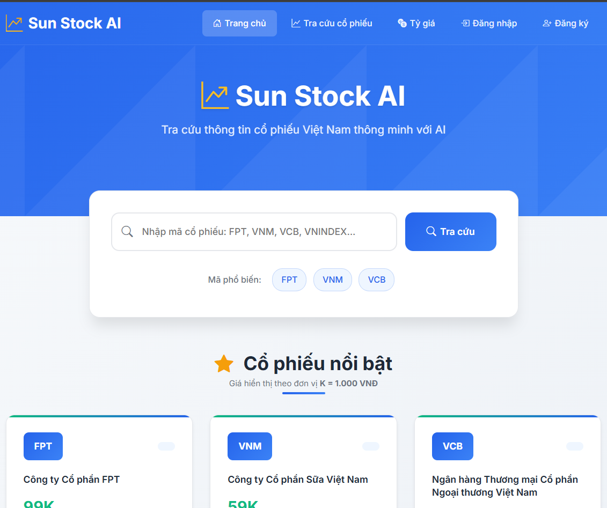

Laravel Stock App (Laravel 12)

## Screenshot

==================================================
🛠 TECH STACK
==================================================

- Backend: Laravel 12 (PHP 8.2+)
- Frontend: Blade + Bootstrap 4 (CDN)
- Python Integration: vnstock >= v3
- Database: MySQL
- Local server: XAMPP 8.2+

==================================================
🚀 FEATURES
==================================================

- Enter any stock symbol (ex: E1VFVN30, FPT, VCB...)
- Display historical data:
    - Date
    - Open / High / Low / Close price
    - Volume
- Save all data to MySQL database
- Smart check to avoid redundant crawling if data exists
- Easy Python integration via `get_stock.py`

==================================================
⚙️ INSTALLATION GUIDE
==================================================

1. Clone the project
---------------------
git clone https://github.com/nhatnguyen94/stock-app.git
cd stock-app

2. Install Laravel dependencies
---------------------
composer install
cp .env.example .env
php artisan key:generate

3. Setup .env file with MySQL info
---------------------
DB_CONNECTION=mysql
DB_HOST=127.0.0.1
DB_PORT=3306
DB_DATABASE=stock_app
DB_USERNAME=root
DB_PASSWORD=

4. Create the database in MySQL
---------------------
Manually create a database named "stock_app" before continuing.

5. Run database migration
---------------------
php artisan migrate

6. Install Python & vnstock library
---------------------
pip install vnstock

7. Check that python script works
---------------------
Run: python public/python/get_stock.py E1VFVN30
Check for expected output.

8. Start local server
---------------------
php artisan serve

Visit: http://localhost:8000

==================================================
📁 PROJECT STRUCTURE
==================================================

├── app/
│   └── Http/
│       └── Controllers/
│           └── StockController.php
├── public/
│   └── python/
│       └── get_stock.py
├── resources/
│   └── views/
│       └── stock/
│           └── stock.blade.php
├── routes/
│   └── web.php
├── database/
│   └── migrations/
│       └── create_stocks_and_prices_tables.php
├── .env
├── README.txt

==================================================
📄 SAMPLE USAGE
==================================================

- Access http://localhost:8000
- Input stock code (ex: FPT or E1VFVN30)
- View latest historical prices shown in table
- Data is pulled once & saved to DB

==================================================
📬 AUTHOR
==================================================

Created by: Sun Nguyen
Email: nhat.nguyenminh94@gmail.com
GitHub: https://github.com/nhatnguyen94/stock-app

==================================================
📜 LICENSE
==================================================

MIT License © 2025
