# Website Tour — what Sun Stock AI looks like

A page-by-page walkthrough of the running site (Vietnamese UI). Every screenshot was taken on **2026-09-20** from the Docker stack with real market data; signed-in pages use a throwaway demo account with sample holdings that was deleted afterwards.

> **What is deliberately not shown:** login / register / password-reset forms, profile and account pages, the admin panel, e-mail addresses, tokens, API keys, `.env` values and anything else an attacker could use. The admin panel and authentication are described in words only — see [RBAC.md](RBAC.md) for permissions.

**Contents**

1. [Navigation](#1-navigation)
2. [Home](#2-home-)
3. [Stock detail](#3-stock-detail-stocksymbolfpt)
4. [Company profile](#4-company-profile-companyfpt)
5. [Compare stocks](#5-compare-stocks-stockcompare)
6. [Stock screener](#6-stock-screener-stockscreener)
7. [Open-end funds](#7-open-end-funds-funds)
8. [Gold prices](#8-gold-prices-gold)
9. [Exchange rates](#9-exchange-rates-exchange-rate)
10. [News](#10-news-news)
11. [AI assistant](#11-ai-assistant)
12. [Portfolios](#12-portfolios-portfolio-sign-in-required)
13. [Watchlist](#13-watchlist-watchlist-sign-in-required)
14. [Accounts](#14-accounts-and-the-admin-panel)
15. [Mobile](#15-mobile)
16. [Where the data comes from](#16-where-the-data-comes-from)

Access legend: 🌐 public · 🔐 needs a (verified) account.

---

## 1. Navigation

A blue top bar on every page: **Trang chủ** (Home) · **Cổ phiếu** (Stocks: lookup, compare, screener) · **Quỹ mở** (Funds) · **Danh mục** (Portfolios) · **Thị trường** (Market: exchange rates, gold) · **Tin tức** (News) · sign-in / account menu. Above the content a dark **live ticker** scrolls VN-Index, VN30, HNX-Index and the most active symbols with colour-coded change. A round **robot button** at the bottom-right opens the AI chat on every page, and an **up arrow** appears after scrolling.

Prices on stock pages use the exchange convention of **thousands of VND** (`71,7` = 71,700 ₫); money on portfolio and company pages is shown in full VND.

---

## 2. Home 🌐 `/`

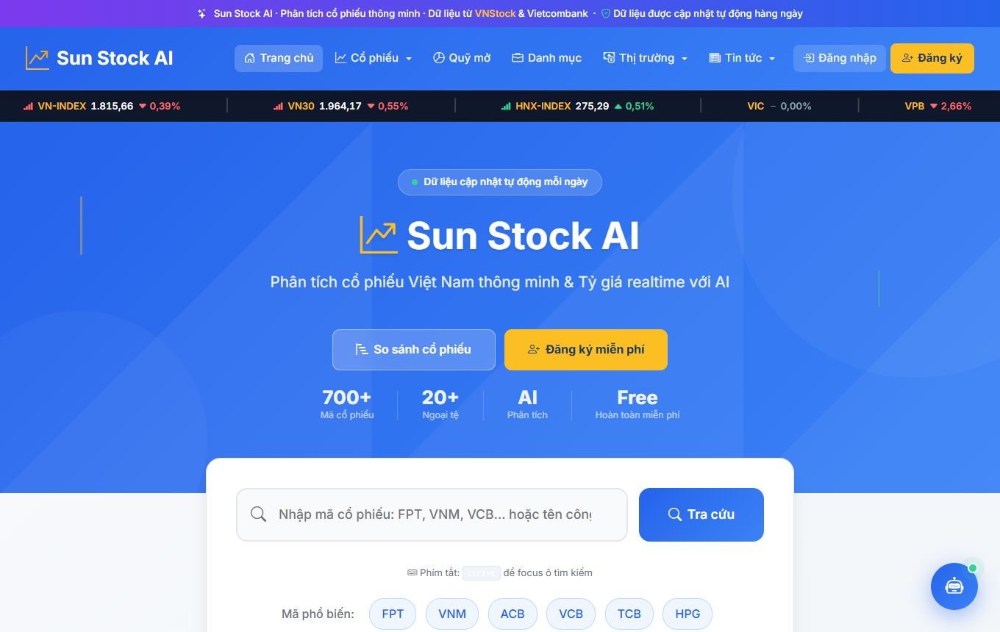

- **Search** with autocomplete over ~700 listed symbols (code or company name, `Ctrl+K` to focus) and one-click popular symbols.
- Hero call-to-actions: compare stocks, register.

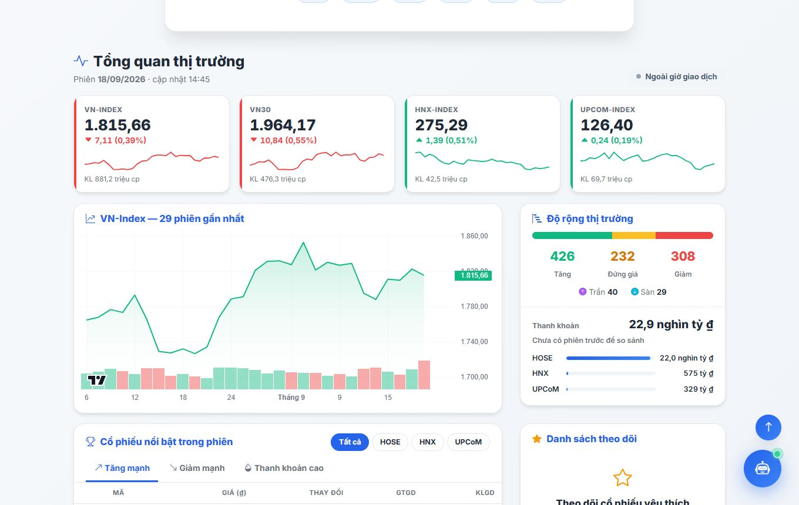

**Market overview** (one ~4-second call to the exchange feed refreshes the whole section; every 5 minutes during the session):

- **Index cards** — VN-Index, VN30, HNX-Index, UPCoM-Index with change, 30-session sparkline and volume.
- **VN-Index chart** — the last 29 sessions with volume bars.
- **Market breadth** — advancers / unchanged / decliners plus ceiling and floor counts; **liquidity** in trillions of VND and split by HOSE / HNX / UPCoM.
- **Top movers** — three tabs (*Tăng mạnh* gainers, *Giảm mạnh* losers, *Thanh khoản cao* most traded) with an exchange filter.
- **Watchlist card** — your starred symbols (or an invitation to start one).
- An **"Outside trading hours"** badge and the session date make clear when the numbers are not live.

Further down: featured stocks, why-choose-us, today's Vietcombank exchange rates, hot industries (paged), a portfolio teaser and the latest news from VnExpress, CafeF and Dân Trí. The **AI market prediction** button lives here too (see [§11](#11-ai-assistant)).

---

## 3. Stock detail 🌐 `/stock?symbol=FPT`

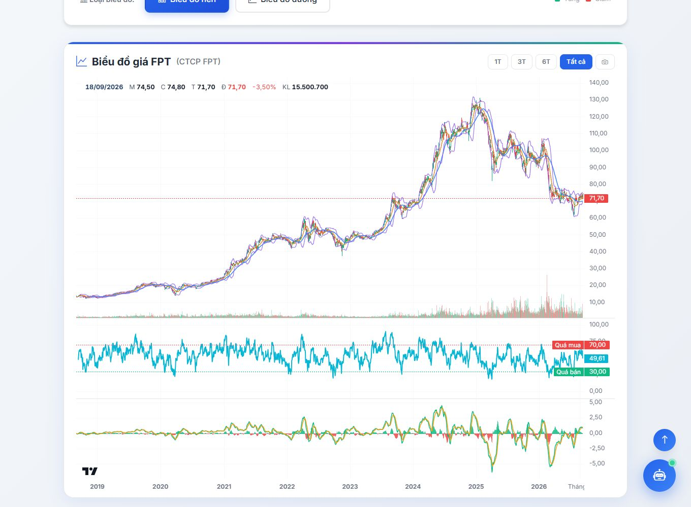

- Header with price, daily change and date, plus shortcuts: **Theo dõi** (star), **Thêm vào danh mục** (add to a portfolio), **Hồ sơ công ty**, **So sánh**.
- **Interactive TradingView-style chart** (Lightweight Charts): candlesticks or line, ranges 1T / 3T / 6T / All, volume, hover read-out of O/H/L/C/volume, screenshot button.
- **Indicators** you can toggle: MA20, MA50, MA200, Bollinger bands as overlays; **RSI(14)** (with overbought/oversold lines) and **MACD** (histogram + signal) as separate panes. In the image above MA20, MA50, Bollinger, RSI and MACD are all on.
- Below the chart: the price-history table and a **corporate financials** block that loads on demand (the "Tải dữ liệu tài chính" button).
- **Speed:** the first click on a symbol used to take ~10 s; history now comes from a fast source directly, stale symbols render instantly from the database and refresh in the background.

---

## 4. Company profile 🌐 `/company/FPT`

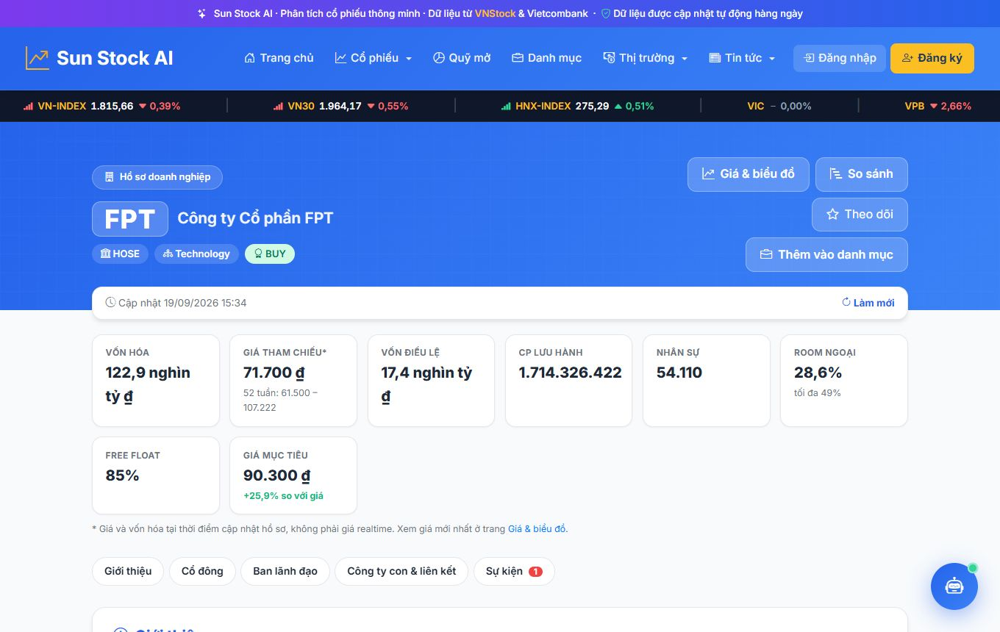

Key figures (market cap, reference price and 52-week range, charter capital, shares outstanding, employees, foreign room, free float, analyst target price with upside) and tabs for **Giới thiệu** (business lines, history), **Cổ đông** (ownership structure and major shareholders), **Ban lãnh đạo** (board, executives, supervisors), **Công ty con & liên kết** and **Sự kiện** (dividends, AGMs, issues). Profiles are fetched from two sources, merged, cached in the database and refreshed in the background.

---

## 5. Compare stocks 🌐 `/stock/compare`

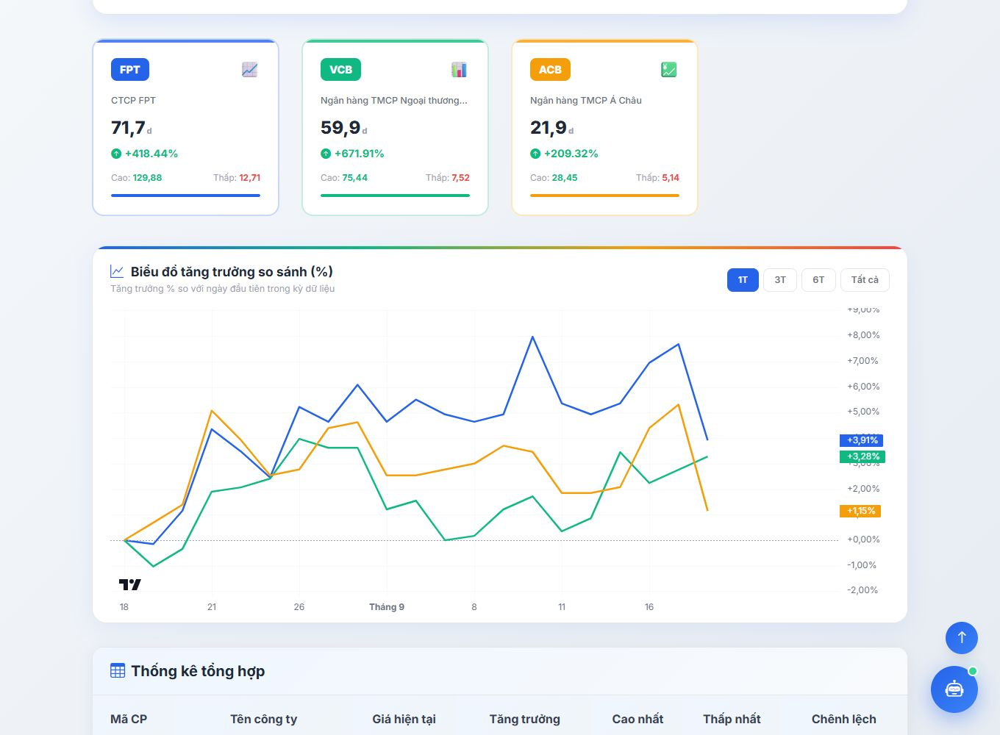

Pick up to **4 symbols**; each is rebased to 0 % at the first common day so very different price levels are comparable. Summary cards (price, growth, high, low), range buttons (1T / 3T / 6T / All) and a statistics table below the chart.

---

## 6. Stock screener 🌐 `/stock/screener`

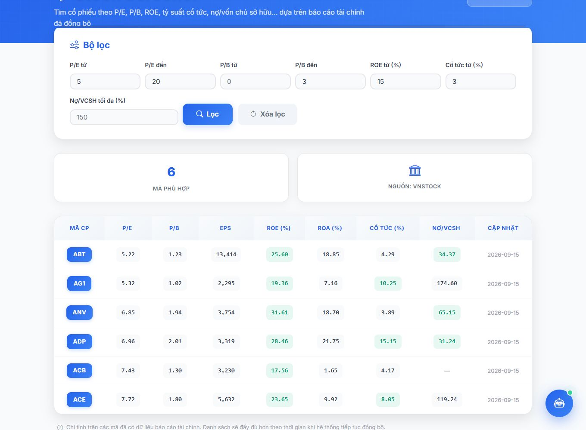

Filter the market by **P/E, P/B, ROE, dividend yield and debt-to-equity** from synced financial statements. The example applies P/E 5–20, P/B ≤ 3, ROE ≥ 15 %, dividend ≥ 3 % and returns 6 symbols with colour-coded ratios. Results link through to the stock page.

---

## 7. Open-end funds 🌐 `/funds`

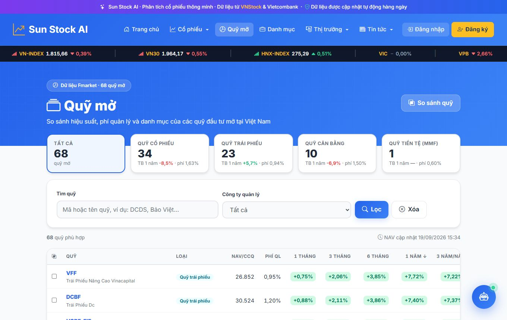

The catalogue of **68 open-end funds** (Fmarket): counts per type (equity, bond, balanced, money market) with average 1-year return and management fee, search by code or name, filter by management company, and a sortable table of NAV, fee and 1M / 3M / 6M / 1Y / 3Y returns. Tick funds to **compare** them.

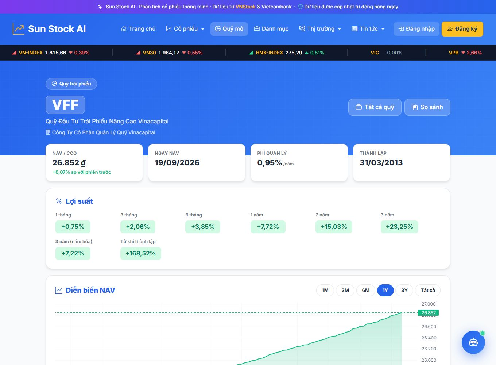

**Fund detail** — NAV per unit, NAV date, fee, inception date, all return windows, and the **NAV curve** (1M … All) with the period return, maximum drawdown and annualised volatility, then the **asset allocation** (bonds / cash / equities) and the **top 10 holdings** with sector and weight. `/funds/compare` overlays several funds.

---

## 8. Gold prices 🌐 `/gold`

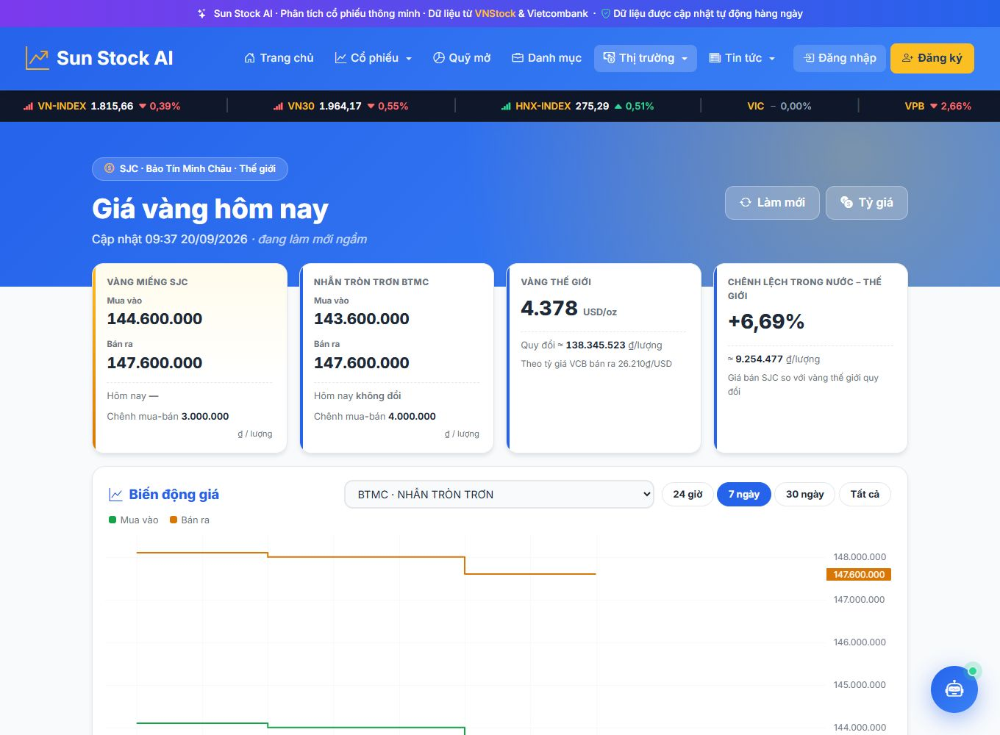

**SJC** bars, **Bảo Tín Minh Châu** rings and silver, and the **world gold price** converted to VND per tael at the Vietcombank rate — plus the domestic premium over the world price. Buy/sell/spread cards with the daily move, a **price-history chart** (24 h / 7 d / 30 d / all, own history recorded every 15 minutes), a full price table, a **tael ⇄ chi calculator** and notes on the data. Updates itself in the background.

---

## 9. Exchange rates 🌐 `/exchange-rate`

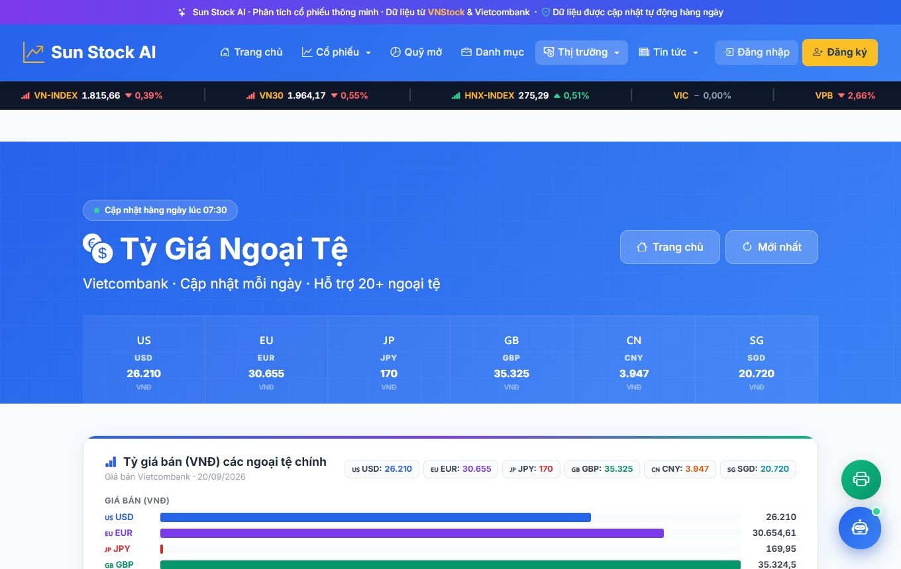

Vietcombank rates for 20+ currencies (updated daily 07:30): headline strip for USD, EUR, JPY, GBP, CNY, SGD, a bar comparison of selling rates, a **look-up by date** and the last three days side by side, with printing.

---

## 10. News 🌐 `/news`

Aggregated market news from **VnExpress, CafeF and Dân Trí**, refreshed every 30 minutes: card grid with thumbnail, source, category and relative time, full-text search and a category sidebar (Chứng khoán, Doanh nghiệp, Kinh doanh, Thị trường). (No screenshot: the cards show third-party photos and headlines.)

---

## 11. AI assistant

Two entry points, both powered by the Groq API (model chain configurable in `.env`):

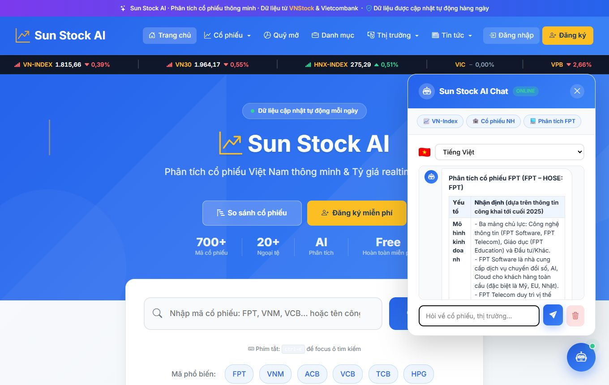

**Chat popup** — available on every page: suggested questions, Vietnamese/English switch, typing indicator, Markdown answers (bold, lists, tables), Enter to send (safe with Vietnamese input methods), Esc or a click outside to close. It only answers finance questions and refuses attempts to change its instructions.

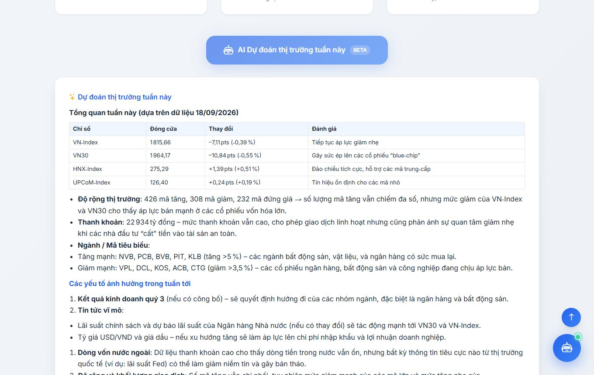

**AI weekly market prediction** — the button on the home page. The prompt is grounded with the app's real market snapshot (index levels, breadth, liquidity, top movers), so the answer quotes actual figures rather than invented ones; the result is cached for two hours and a failure is never cached.

---

## 12. Portfolios 🔐 `/portfolio`

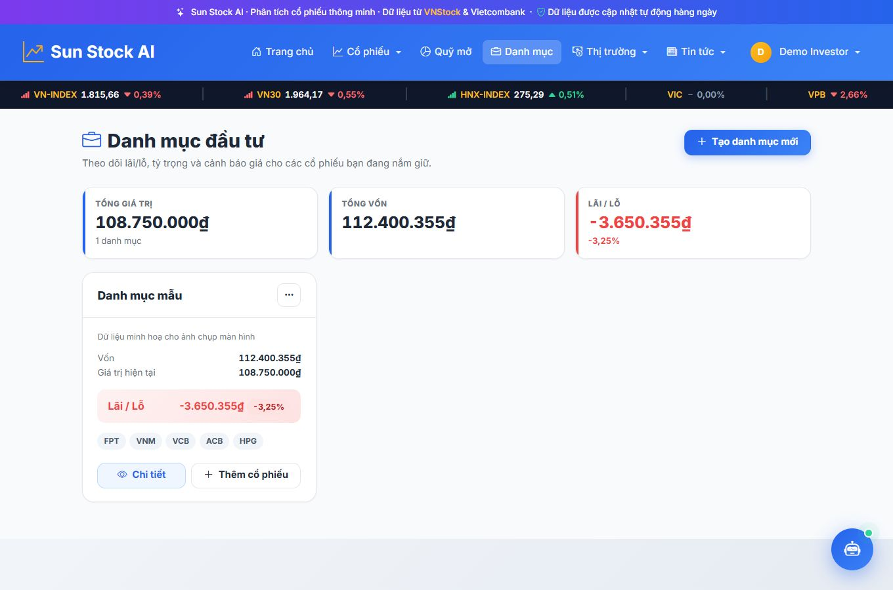

Your portfolios with total value, invested capital and profit/loss, per-portfolio cards and quick actions. *(Demo account, sample data.)*

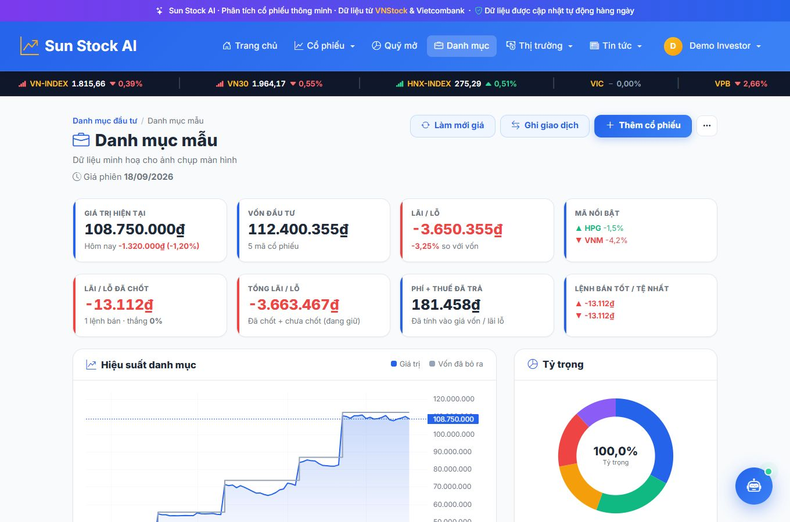

**Portfolio detail** — value, invested capital, unrealised P&L and today's move; **realised P&L, win rate, fees and taxes** from the **buy/sell ledger** (weighted-average cost, undo of the last trade, CSV export); best/worst performers; a **performance chart** rebuilt from daily closes and buy dates; an **allocation** donut.

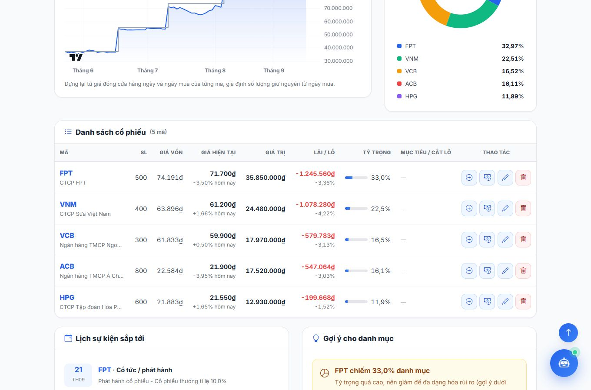

Holdings table with average cost, live price, value, P&L, weight, target/stop-loss and row actions (buy more, record a sale, edit, remove), then **upcoming dividends** and **rebalancing suggestions** (for example flagging a position that is over-weight).

---

## 13. Watchlist 🔐 `/watchlist`

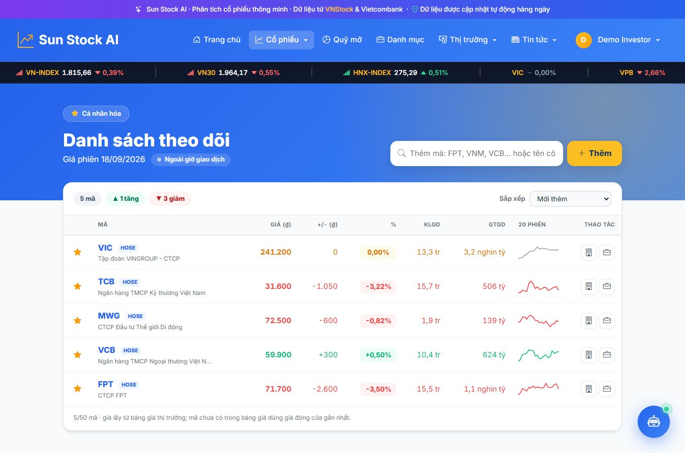

Star any symbol from the home, stock or company page. The list shows price, change, volume, traded value and a 20-session sparkline with gainers/decliners counts, sorting, quick add, and one-click links to the company profile and to add the symbol to a portfolio.

---

## 14. Accounts and the admin panel

- **Accounts** — register with e-mail verification, sign in, password reset by e-mail, profile with avatar. Screens are intentionally not pictured.
- **Admin panel** — a separate, permission-driven back office (Tabler 1.5, light/dark theme, command palette) for users, roles and permissions, stocks, portfolios, news sources, data-sync status and the queue monitor. Access is controlled by database-driven roles ([RBAC.md](RBAC.md)); it is not pictured here.

---

## 15. Mobile

The layout is responsive: the menu collapses to a hamburger, cards stack, tables scroll horizontally.

  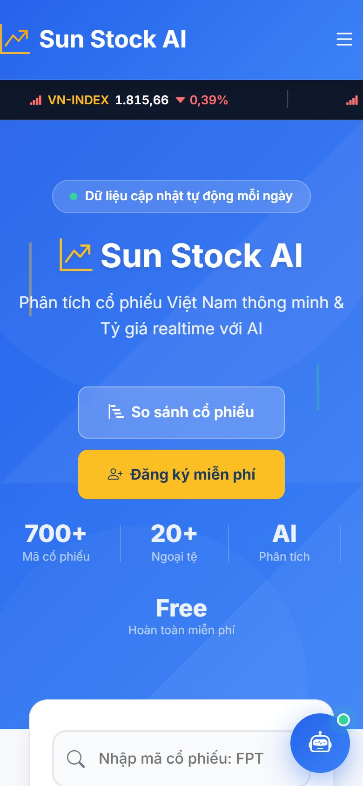
  &nbsp;&nbsp;
  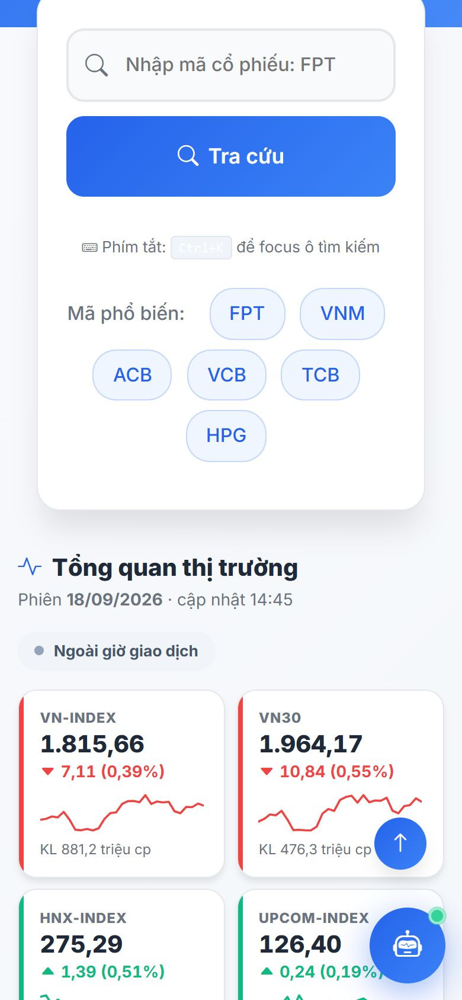

---

## 16. Where the data comes from

| Data | Source | Refresh |
|---|---|---|
| Prices, history, indices, breadth, movers | `vnstock` (KBS / VCI feeds) | market overview every 5 min in session; daily prices after close |
| Company profile, financial statements | `vnstock` | cached in DB, refreshed in the background |
| Open-end funds | Fmarket via `vnstock` | daily |
| Gold and silver | SJC, Bảo Tín Minh Châu, world gold via `vnstock` | every 15 min, 07:00–19:00 |
| Exchange rates | Vietcombank | daily 07:30 |
| News | VnExpress, CafeF, Dân Trí RSS | every 30 min |
| AI | Groq API | on demand |

Details: [PYTHON_INTEGRATION.md](PYTHON_INTEGRATION.md) · architecture: [STRUCTURE.md](STRUCTURE.md) · run it yourself: [QUICKSTART.md](QUICKSTART.md).
